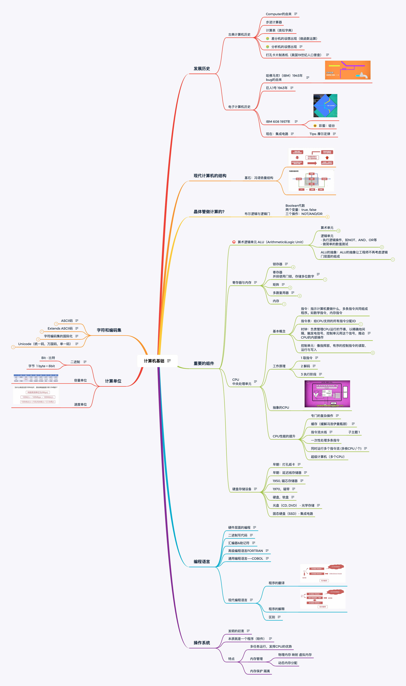

> 破山中贼易，破心中贼难。 - 王阳明

# 思维导图

# 计算机基础

简单的组件，通过层层抽象，做出复杂的操作。

计算机中的很多东西，底层其实都很简单，让人难以理解的，是一层层精妙的抽象

## 发展历史

### 古典计算机历史

- Computer 的由来

  最早使用 "计算机" 一词的文献 \N 来自 1613 年的一本书，作者 Richard Braithwait

  “我听说过的计算者里最厉害的，能把好几天的工作量大大缩减"

  "Computer" 偶尔会用机器帮忙，但大部分时候靠自己

  此时的 Computer 指的不是机器，而是一种职业

* 步进计算器
* 计算表（类似字典）
* 差分机的设想出现（做函数运算）
* 分析机的设想出现

  英国数学家 Ada Lovelace 给分析机写了假想的程序，她说：
  "未来会诞生一门全新的，强大的，专为分析所用的语言"
  因此 Ada 被认为是世上第一位程序员.

* 打孔卡片制表机（美国 19 世纪人口普查）

  在纸上打孔 → 孔穿过针 → 针泡入汞 → 电路连通 → 齿轮使计数+1

  效率提高 10 倍，人口普查 2.5 年搞定，节省上百万美元

### 电子计算机历史

- 哈佛马克 1（IBM）1945 年

  bug 的由来

  使用继电器，用电磁效应，控制机械开关，缺点为有磨损和延迟

  继电器是：用电控制的机械开关
  继电器里，有根"控制线路"，控制电路是开还是关，"控制线路" 连着一个线圈，当电流流过线圈，线圈产生电磁场，吸引金属臂，从而闭合电路

  这台机器最早的用途之一 是给"曼哈顿计划"跑模拟

- 巨人 1 号 1943 年

  把两个电极装在一个气密的玻璃灯泡里，其中一个电极可以加热，从而发射电子。另一个电极会吸引电子，形成"电龙头"的电流。
  作用和继电器一样，外表像个小灯泡

  使用真空管（三极管），制造出世界上第一个可编程的计算机

  巨人 1 号 在英国的"布莱切利园", 用于破解纳粹通信

- IBM 608 1957 年

  1947 年 晶体管（贝尔实验室）出现，使用的是固态的半导体材料，相对真空管更可靠

  它是一个开关，可以用控制线路来控制开或关。

  晶体管有两个电极，电极之间有一种材料隔开它们，这种材料有时候导电，有时候不导电，这叫半导体。控制线连到一个 "门" 电极，通过改变 "门" 的电荷，可以控制半导体材料的导电性，来允许或不允许 电流流动

  如今，计算机里的晶体管小于 50 纳米，晶体管不仅小，还超级快，每秒可以切换上百万次，并且能工作几十年

  608 是第一个消费者可购买的晶体管计算机出现

  彩蛋：硅谷

- 现在：集成电路

  德州仪器

  采用一定的工艺，把一个电路中所需的晶体管、电阻、电容和电感等元件及布线互连一起，制作在一小块或几小块半导体晶片或介质基片上，然后封装在一个管壳内，成为具有所需电路功能的微型结构；其中所有元件在结构上已组成一个整体，使电子元件向着微小型化、低功耗、智能化和高可靠性方面迈进了一大步

  Tips: 摩尔定律

  intel 创始人之一：戈登 摩尔

  当价格不变时，集成电路上可容纳的元器件的数目，约每隔 18-24 个月便会增加一倍，性能也将提升一倍

## 现代计算机的结构

### 基石：冯诺依曼结构

## 晶体管做计算的？

### 布尔逻辑与逻辑门

- Boolean 代数
  两个变量：true, false
  三个操作：NOT/AND/OR

  - NOT

    半导体通电 True，则线路接地，无输出电流，为 False。

    半导体不通电 False，则输出电流从右边输出，为 True。

  - AND

    串联两个晶体管，仅当 2 个晶体管都通电，输出才有电流（True）

  - OR

    使用 2 个晶体管，将它们并联到电路中，只要有一个晶体管通电，则输出有电流（True）

  - 特殊逻辑：异或（XOR）

    2 个输入控制一个输出。当 2 个输入均为 True 时，输出 False，其余情况与 OR 门相同。

## 重要的组件

### 算术逻辑单元 ALU（Arithmetic&Logic Unit）

- 算术单元

  - 半加器 (用于计算个位（Bit）的数字加减)

    - 计算 1+1， 1+0，0+0
    - 抽象（输出 “总和” “进位”）

  - 全加器 (用于计算超过 1 位(Bit)的加法)
    - 更多的扩展
    - 用半加器与全加器组合做 8 位数的加法
    - 算术单元支持的其他运算 使用更多不同的逻辑门组合
    - 又一个彩蛋：早期吃豆人只有 255 关卡， 256 是乱码

- 逻辑单元
  - 执行逻辑操作，如 NOT、AND、OR 等
  - 做简单的数值测试
  - eg: 检测输出是否为 0

> ALU 的抽象：ALU 的抽象让工程师不再考虑逻辑门层面的组成

### 寄存器与内存

当玩游戏、写文档时如果断电，进度会丢失，这是为什么？

原因是这是电脑使用的是 RAM（随机存取存储器），俗称内存，内存只能在通电情况下存储数据。

- 锁存器

  锁存器是利用 AND、OR、NOT 逻辑门，实现存储 1 位数字的器件

  - 它存住了一位（bit）的信息
  - 门锁（对锁存器的扩展，更方便理解）
    - 一切从 0 开始
    - 当允许写入线为 0 时，数据输入的变化，不影响数据输出，一直为 0
    - 允许写入线为 1 时，数据输入的变化会影响数据输出
    - 再将允许写入写设置为 0，数据输入无效，输出保留最近一次允许写入为 1 时的值

- 寄存器（并排使用门锁，存储多位数字）

  寄存器的问题：64 位寄存器要 64 根数据线，64 根连接到输出端，1 根线启动所有的锁存器，一共要 129 根线。 如果是 256 位需要 513 根线

  我们通过合理的改造寄存器的布局结构，通过下面的矩阵能解决上述问题

- 矩阵

  矩阵中不并列放置锁存器，而是做成网格的样子

  这时候对于 256 位的数据只需要 35 根线，

  - 1 根数据线
  - 1 根允许写入线
  - 1 根允许读取线
  - 还有 16 行 + 16 列的线用于选择锁存器

  但是矩阵中的问题是我们需要知道存储的 1bit 的数据在哪一行哪一列，比如 12 行 8 列
  12 的二进制是 1100
  8 的二进制是 1000，
  为了将地址转化为行和列，需要使用多路复用器

- 多路复用器（输入一个四位数字，它会把那根线连接到相应的输出线）

  - 扩展模块：8 个并排的多路复用器，用来存储 8 位数字。

  矩阵虽然是 16 x 16 的，可以存储 256 位数据，但是它只是能存这么多的东西，如果要存储一个完整的 8 位数字（一个整体）是无法在同一个矩阵中存下 8 个的，因为你不知道这 8 个数字都存在矩阵的哪个位置了（第几行，第几列）

  16\*16 的门锁矩阵虽然有 256 个位置，但每次只能存/取其中 1 个位置的数字。因此，要表示 8 位数字，就需要同时调用 8 个门锁矩阵

  1 个 8 位数，会按位数分成 8 个数，分别存储在 8 个矩阵的同一个位址中。

  8 个矩阵，则可以记录 256 个 8 位数字（就是 256 个字节的数字）

  使用方法：在多路复用器中输入位址，x 行 x 列（2 进制），即可点亮 x 行 x 列的锁存器。

- 内存（将多路复用器的存储模块看做一个整体的可寻地址，组合而来， 每个地址可以读、写一个 8 位的值）

### CPU

中央处理单元

中央处理单元，通常由寄存器/控制单元/ALU/时钟组成。与 RAM 配合，执行计算机程序。CPU 和 RAM 之间用“地址线”、“数据线”和“允许读/写线”进行通信。

CPU 负责执行程序

程序由一个一个操作组成，这些操作叫“指令”，因为它们指示计算机要做什么

如果是数学指令：CPU 会让 ALU 进行运算
也可能是内存指令，CPU 会和内存通信，然后读写值

- 基本概念

  - 指令：指示计算机要做什么，多条指令共同组成程序。如数学指令，内存指令
  - 指令表：给 CPU 支持的所有指令分配 ID
  - 时钟：负责管理 CPU 运行的节奏，以精确地间隔，触发电信号，控制单元用这个信号，推动 CPU 的内部操作
    - 时钟速度：CPU 执行“取指令 → 解码 → 执行”中每一步的速度叫做“时钟速度”，单位赫兹 Hz，表示频率。
    - 超频，修改时钟速度，加快 CPU 的速度，超频过多会让 CPU 过热或产生乱码
    - 降频，降低时钟速度，达到省电的效果，对笔记本/手机很重要

  - 控制单元：像指挥部，有序的控制指令的读取、运行与写入
    - 指令地址寄存器，类似于银行取号。该器件只按顺序通报地址，让RAM按顺序将指令交给指令寄存器
    - 指令寄存器：存储具体的指令代码。

- 工作原理
  - 1 取指令
    
    指令地址寄存器发地址给RAM→RAM发该地址内的数据给指令寄存器→指令寄存器接受数据

  - 2 解码
    
    指令寄存器根据数据发送指令给控制单元 →控制单元解码（逻辑门确认操作码）

  - 3 执行阶段

    控制单元执行指令(→涉及计算时→调用所需寄存器→传输入&操作码给ALU执行）→调用RAM特定地址的数据→RAM将结果传入寄存器→指令地址寄存器+1

- CPU 性能的提升
  - 专门的复杂操作（新增专门用来做乘除法的算术单元）

    早期通过加快晶体管速度，来提升CPU速度。但很快该方法到达了极限

    后来给CPU设计了专门除法电路+其他电路来做复杂操作：如游戏，视频解码。 即专门的指令越来越多了

  - 缓存（缓解冯洛伊曼瓶颈）
    
    如何快速传数据给CPU?
    
    RAM是CPU之外独立的原件，CPU和RAM的数据传递要用线来连接，电信号的传递接近光速的，但是CPU每秒能处理上亿条指令，RAM还需要时间找地址，取数据，配置，输出数据。
    
    一条从RAM取数据的指令可能需要多个时钟周期，导致CPU闲置空等数据

    为了不让CPU空等数据，在CPU内部设置了一小块内存，称为缓存，让RAM可以一次传输一批数据到CPU中。（不加缓存，CPU没位置放大量数据）

  - 指令流水线
      
    作用：让取址→解码→执行三个步骤同时进行。并行执行指令，提升CPU性能

    原本需要3个时钟周期执行1个指令，现在只需要1个时钟周期

    设计难点：数据具有依赖性

  - 一次性处理多条指令
  
  - 同时运行多个指令流 (多核CPU / 个)

    一个CPU芯片中，有多个独立处理单元。但因为它们整合紧密，可以共享一些资源（缓存）。

  - 超级计算机（多个CPU）

### 硬盘存储设备

存储器（Storage）和内存（Memory）有点不同
任何写入"存储器"的数据，比如你的硬盘 \N 数据会一直存着，直到被覆盖或删除，断电也不会丢失
内存是"易失性"的速度快，"非易失性"的速度慢

- 早期：打孔纸卡
  
  坏处是读取慢，只能写入一次

- 早期：延迟线存储器

  将金金属线环绕成一个线圈，用金属线的震动代表数据

- 1950, 磁芯存储器

  像甜甜圈的小型磁圈
  给磁芯绕上电线，并施加电流可以将磁化在一个方向
  关掉电流，继续保持磁化
  如果反方法施加电流，磁化的方向会翻转，这样就可以存储 0 和 1

- 1970，磁带

  写头：绕了电线，电流通过产生磁场，导致磁带的一小部分被磁化，电流的方向决定了极性，代表 0 和 1

  读头：可以非破坏性的监测极性

  缺点：磁带是连续的，读取比较慢，必须倒带或快进到特定的位置

- 硬盘，软盘

  原理类似，表面有磁性，有写入头和读取头，可以处理 0 和 1

- 光盘（CD, DVD） - 光学存储

  光盘表面有很多小坑，造成光的不同反射
  光学传感器能捕捉到，并解码为 0 或 1

- 固态硬盘（SSD）- 集成电路

## 编程语言

### 硬件层面的编程

打孔纸卡/纸带 在纸卡上打孔，用读卡器读取连通电路，进行编程。原因，穿孔纸卡便宜、可靠也易懂。62500 张纸卡=5MB 数据

插线板：通过插拔线路的方式，改变器件之间的连接方式，进行编程

面板拨开关（1980s 前）：通过拨动面板上的开关，进行编程。输入二进制操作码，按存储按钮，推进至下一个内存位，直至操作完内存，按运行键执行程序。

### 二进制写代码

计算机只能理解二进制（也叫机器语言或者机器码）

人们先在纸上写伪代码，用"操作码表"（字典）把伪代码转成二进制机器码。

翻译完成后，程序可以喂入计算机并运行
这个二进制代码也需要人工的输入进计算机

### 汇编器&助记符

程序员开发出一种新语言， 更可读 更高层次。每个操作码分配一个简单名字，叫"助记符"。但计算机不能读懂“助记符”，因此人们写了二进制程序“汇编器来帮忙”

作用：汇编器读取用"汇编语言"写的程序，然后转成"机器码"。

### 高级编程语言 FORTRAN

FORTRAN 编译器会把代码转成机器码

汇编只是修饰了一下机器码，一般来说，一条汇编指令对应一条机器指令，所以汇编码和底层硬件的连接很紧密，汇编器仍然强迫程序员思考底层逻辑。

出现了高级编程语言，一行高级编程语言, 可以转成几十条二进制指令

过程：高级编程语言 → 编译器 → 汇编码/机器码

### 通用编程语言——COBOL

研发可以在不同机器上通用编程语言

每个计算架构需要一个 COBOL 编译器，不管是什么电脑都可以运行相同的代码，得到相同结果。

### 现代编程语言

1960 ：LGOL, LISP 和 BASIC 等语言

70 年代有：Pascal，C 和 Smalltalk

80 年代有：C++，Objective-C 和 Perl

90 年代有：Python，Ruby 和 Java

- 程序的翻译&程序的解释

  编译器是把源程序的每一条语句都编译成机器语言,并保存成二进制文件,这样运行时计算机可以直接以机器语言来运行此程序,速度很快;

  而解释器则是只在执行程序时,才一条一条的解释成机器语言给计算机来执行,所以运行速度是不如编译后的程序运行的快的

  翻译型高级语言：C++, C, GO
  解释性高级语言：JS, Php, Python

## 操作系统

### 发明的初衷

早期都是卡片上写好程序，操作员放入计算机运算，一次运行一个程序，很麻烦，为了计算机能自动运行多个程序而促进操作系统诞生

计算机型号不同，外接设备不同，程序员写程序要兼顾不同的硬件，只能“祈祷正常运行”，操作系统提供了统一的 API

### 本质就是一个程序（软件）

操作系统本质也是软件，不过比较特殊，它有操作硬件的特殊权利，并且可以运行和管理其他程序

### 特点

- 多任务运行，发挥 CPU 的优势
- 内存管理
  - 物理内存 映射 虚拟内存
  - 动态内存分配

- 内存保护 隔离

## 计算单位

### 二进制

- 晶体管只有两种状态（通电 1，断电 0）

- 数学中的“布尔代数”分支，可以用 True 和 False（可用 1 代表 True，0 代表 False）进行逻辑运算，代替实数进行计算

- 状态越多，信号越混乱

- Bit - 比特
- 字节 1 byte = 8bit

### 容量单位

### 速度单位

## 字符和编码集

### ASCII 码

使用 7bits 就可以完全表示所有 ASCII 码
包含 95 个可打印的字符
包含 33 个不可打印字符

### Extends ASCII 码

一些专业领域的符合和其他国家的一些字符无法表示，就产生了 Extends ASCII 码

Extends ASCII 码一共 255 个字符，
包括常见的数学运算符
带音标的欧洲字符
其他常用符，表格符

### 字符编码集的国际化

然而随着技术的普及，扩展的阿斯克码任然不能满足需求，出现了字符编码集的国际化

- 欧洲，亚洲，拉美等地区语言的多样性
- 语言体系不一样，不以有限的字符组合语言
- 中日韩的语言较为复杂

- GB2312, GBK

### Unicode（统一码，万国码，单一码）

为了统一所有文字的编码，Unicode 应运而生。Unicode 把所有语言都统一到一套编码里，这样就不会再有乱码问题了

Unicode通常用两个字节表示一个字符，原有的英文编码从单字节变成双字节，只需要把高字节全部填为0就可以

2 两个字节代表一个百字符，这样一共可以表示 65536 个字符。显然，这样要表示各种语言中所有的字符是远远不够度的。

Unicode4.0 规范考虑到了这种情况，定义专了一组附加字符编码，附加字符编码采用 2 个 16 位来表示，这样最多可以定义 1048576 个附加字符，目前 unicode4.0 只定义了 45960 个附加字符

Unicode 只是一个编码规范，目前实际实现的 unicode 编码只要有三种：UTF-8,UCS-2 和 UTF-16，三种 unicode 字符集之间可以按照规范进行属转换

- UTF-8 以字节为单位对 Unicode 进行了编码

### 进程和线程
进程（process）和线程（thread）是CPU 工作时间片的一个描述。

进程描述了 CPU 在运行指令及加载和保存上下文所需的时间，放在应用上来说就代表了一个程序。线程是进程中的更小单位，描述了执行一段指令所需的时间。

对于操作系统来说，一个任务就是一个进程（Process），比如打开一个浏览器就是启动一个浏览器进程，打开一个记事本就启动了一个记事本进程，打开两个记事本就启动了两个记事本进程，打开一个Word就启动了一个Word进程。

有些进程还不止同时干一件事，比如Word，它可以同时进行打字、拼写检查、打印等事情。在一个进程内部，要同时干多件事，就需要同时运行多个“子任务”，我们把进程内的这些“子任务”称为线程（Thread）。

### 并发和并行
我们常常说的多线程的任务处理和多进程的原理是一样的，它们都是调用CPU去“同时”做很多的事情，所谓的“同时”是相对的，如果你的CUP是单核的，需要“同时”处理4件事情，它会轮流让各个任务交替执行，任务1执行0.01秒，切换到任务2，任务2执行0.01秒，再切换到任务3，执行0.01秒……这样反复执行下去。表面上看，每个任务都是交替执行的，但是，由于CPU的执行速度实在是太快了，我们感觉就像所有任务都在同时执行一样。

如果是4核CPU执行4件事情就是“真正”的执行了多任务，但是，由于任务数量远远多于CPU的核心数量，所以，操作系统也会自动把很多任务轮流调度到每个核心上执行。

- 并发是宏观概念，我分别有任务 A 和任务 B，在一段时间内通过任务间的切换完成了这两个任务，这种情况就可以称之为并发。
- 并行是微观概念，假设 CPU 中存在两个核心，那么我就可以同时完成任务 A、B。同时完成多个任务的情况就可以称之为并行