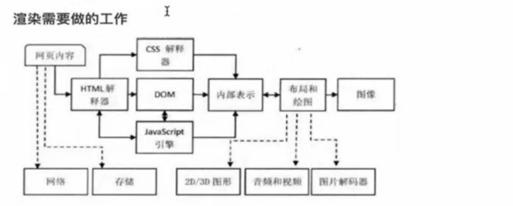
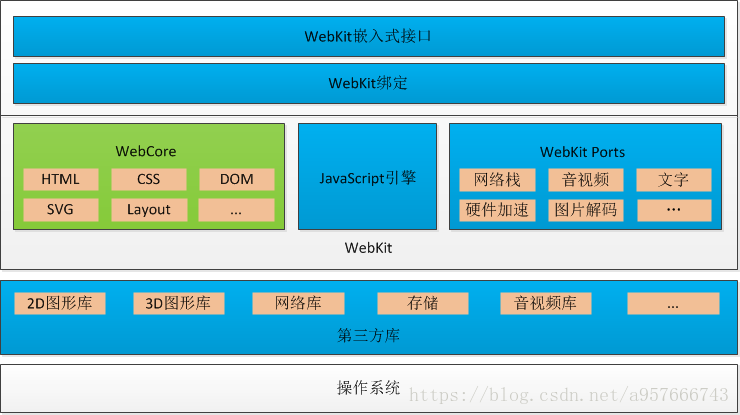

> 富贵五更春梦，功名一片浮云。眼前骨肉亦非真，恩爱翻成仇恨。莫把金枷套颈，休将玉锁缠身。清心寡欲脱凡尘，快乐风光本分 --- 【定场诗】

参考：https://segmentfault.com/a/1190000012925872

# 浏览器

浏览器是用户访问互联网最重要的一个入口

`本质上，浏览器是方便一般互联网用户通过界面解析和发送http协议的软件`

## 了解点浏览器的小知识

- 浏览器是多进程的
- 浏览器之所以能够运行，是因为系统给它的进程分配了资源（cpu、内存）
- 每打开一个Tab页，就相当于创建了一个独立的浏览器进程

有哪些进程？

- Browser进程：浏览器的主进程（负责协调、主控）
  - 负责浏览器界面显示，与用户交互
  - 负责各个页面的管理，创建和销毁其他进程
  - 将Renderer进程得到的内存中的Bitmap，绘制到用户界面
  - 网络资源的管理，下载
- 第三方插件进程
- GPU进程
- 浏览器渲染进程（浏览器内核） 默认每个Tab页面一个进程，互不影响。主要作用为

**在浏览器中打开一个网页相当于新起了一个进程（进程内有自己的多线程）**

我们关注的重点是`渲染进程`，一个渲染进程中有多个线程
* GUI渲染线程
* JS引擎
* 浏览器事件触发线程
* 定时触发器线程
* 异步HTTP请求线程
...

---

## 了解一点浏览器的内核知识

对于浏览器来说，内核是其核心，浏览器的内核需要提供 API 给开发者使用，同时提供最核心的功能，如加载和渲染网页，调用操作系统提供的服务等...

对于浏览器产商来说，高效的使用和开发内核是核心问题，对于 web 开发者来说，理解浏览器的内核的基本机制，才能高效的开发 web 应用

浏览器的内核就是浏览器的渲染引擎，早期的渲染引擎是一个统一的整体，后来随着 js 的权重的不断提高，js 引擎可以理解为慢慢独立出来。

现在我们理解的浏览器的内核 = 浏览器渲染引擎 + 浏览器 JS 引擎

市场上现在的主流内核：

- Chrome 浏览器：Blink + JS 引擎：V8
- Firefox 浏览器：Gecko + JS 引擎：SpiderMonkey
- Safari 浏览器：Webkit + JS 引擎：JavaScriptCore
- IE 浏览器: Trident 内核
- Edge 浏览器：EdgeHTML

浏览器渲染需要的工作流程：


上图表示了浏览器的一般渲染过程，虚线部分是该阶段所依赖的外部模块（不属于渲染引擎）

主要组件：

- HTML 解释器：解释 HTML 文本，将文本 -》 DOM 树
- CSS 解释器：遇到样式，为 DOM 对象计算出样式信息
- JS 引擎：解析 JS 代码，有调用 DOM 接口和 CSSOM 接口的能力
- 布局：结合 CSS 计算出每个 DOM 对象的大小位置信息
- 绘图：将经过布局计算的 DOM 节点绘制成对象

以上这些构成了一个完整的浏览器内核
eg: webkit 的内核架构图：



## 了解浏览器的渲染原理

上面提到的渲染引擎用来将网页代码渲染为用户视觉可以感知的平面文档

不同的渲染引擎在一些流程和细节处理上是有区别的但是大体上都是分成下面的四个阶段：

- 解析代码：HTML 代码解析为 DOM，CSS 代码解析为 CSSOM （CSS Object Model）
- 对象合成：将 DOM 和 CSSOM 合成一棵渲染树（render tree）
- 布局：计算出渲染树的布局（layout）
- 绘制：将渲染树绘制到屏幕

以上四步并非严格按顺序执行，往往第一步还没完成，第二步和第三步就已经开始了。所以，会看到这种情况：网页的 HTML 代码还没下载完，但浏览器已经显示出内容了。

### 输入 URL 发生了什么之浏览器篇 [从浏览器的角度看输入URL页面的解析过程]

先了解一些基本的概念

- 下载（加载） 浏览器将资源下载到本地的过程
- 解析 将一个元素通过一定的方式转换成另一种形式
- DOM 构建 将文档中的所有 DOM 元素构建成一个树型结构，DOM 构建是自上而下进行构建的，会受到 js 的干扰
- CSS 构建 将文档中的所有 CSS 资源合并。
- Render 树 将 DOM 树和 CSS 合并成一棵渲染树，render 树在合适的时机会被渲染到页面中

当我们访问一个页面时，服务端会先返回一个带有一堆 html 字符串的响应信息，接下来就是浏览器渲染的一个完整的流程

- HTML 文档的加载与页面的首次渲染
  - 浏览器首先下载该地址所对应的 html 页面
  - 浏览器解析 html 页面的 DOM 结构
  - 开启下载线程(新开的线程)对文档中的所有资源按优先级排序下载，同时主线程会对文档进行解析
    - 遇到 script 标签时，首先阻塞后续内容的解析，同时检查该 script 是否已经下载下来，如果已下载，便执行代码
    - 遇到 link 标签时，不会阻塞后续内容的解析（比如 DOM 构建），检查 link 资源是否已下载，如果已下载，则构建 cssom
    - 遇到 DOM 标签时，执行 DOM 构建，将该 DOM 元素添加到文档树中。
  - 将 DOM 树和 CSS 合并成一棵渲染树(Render Tree)
    - 渲染树只会包括需要显示的节点和这些节点的样式信息，如果某个节点是 display: none 的，那么就不会在渲染树中显示
      
  - 计算每个 Frame(Element - 元素) 的位置，宽高等属性
    - 这一阶段浏览器要做的事情是要弄清楚各个节点在页面中的确切位置和大小。通常这一行为也被称为“自动重排”
    - 布局流程的输出是一个“盒模型”，它会精确地捕获每个元素在视口内的确切位置和尺寸，所有相对测量值都将转换为屏幕上的绝对像素。
  - 绘制
    - 布局完成后，浏览器会立即发出“Paint Setup”和“Paint”事件，将渲染树转换成屏幕上的像素

TIPS：在 body 中第一个 script 资源下载完成之前，浏览器会进行首次渲染【First-Contentful-Paint】，将该 script 标签前面的 DOM 树和 CSSOM 合并成一棵 Render 树，渲染到页面中。这是页面`从白屏到首次渲染的时间节点`

```html
<body>
  <!-- 白屏 -->
  <div id="div1"></div>
  <!-- 白屏 -->
  <link rel="stylesheet" href="./c1.css" />
  <!-- 白屏 -->
  <link rel="stylesheet" href="./c3.css" />
  <!-- 如果此时 j1.js 尚未下载到本地，则首次渲染，此时的 DOM 树 只有 div1 ，所以页面上只会显示 div1，样式是 c1.css 和 c3.css 的并集。-->
  <!-- 如果此时 j1.js 已经下载到本地，则先执行 j1.js，页面不会渲染，所以此时仍然是白屏。-->
  <!--下面的 js 阻塞了 DOM 树的构建，所以下面的 div2 没有在文档的 DOM 树中。 -->
  <script src="http://test.com:9000/mine/load/case2/j1.js
  "></script>
  <!-- j1.js 执行完毕，继续 DOM 解析，div2 被构建在文档 DOM 树中，此时页面上有了div2 元素，样式仍然是 c1.css 和 c3.css 的并集 -->
  <link rel="stylesheet" href="./c4.css" />
  <!-- c4.css 加载完毕，重新构建render树，样式变成了 c1.css、c3.css 和 c4.css 的并集 -->
  <div id="div2"></div>
</body>
```

再细化一点：

#### 浏览器是如何将HTML文件转化为DOM树的呢？

当我们打开一个网页时，浏览器都会去请求对应的 HTML 文件。虽然平时我们写代码时都会分为 JS、CSS、HTML 文件，也就是字符串，但是计算机硬件是不理解这些字符串的，所以在网络中传输的内容其实都是 0 和 1 这些`字节数据`。当浏览器接收到这些字节数据以后，`它会将这些字节数据转换为字符串，也就是我们写的代码`。

当数据转换为字符串以后，浏览器会先将这些字符串通过词法分析转换为标记（token），这一过程在词法分析中叫做标记化（tokenization）。

那么什么是标记呢？这其实属于编译原理这一块的内容了。简单来说，标记还是字符串，是构成代码的`最小单位`。这一过程会将代码分拆成一块块，并给这些内容打上标记，便于理解这些最小单位的代码是什么意思。

当结束标记化后，这些标记会紧接着转换为 Node，最后这些 Node 会根据不同 Node 之前的联系构建为一颗 DOM 树。


#### 浏览器如何将 CSS 文件转换为 CSSOM 树
和html转化的过程类似，不再细说


在这一过程中，浏览器会确定下每一个节点的样式到底是什么，并且这一过程其实是很消耗资源的。因为样式你可以自行设置给某个节点，也可以通过继承获得。在这一过程中，浏览器得递归 CSSOM 树，然后确定具体的元素到底是什么样式。

```html
<div>
  <a> <span></span> </a>
</div>
<style>
  span {
    color: red;
  }
  div > a > span {
    color: red;
  }
</style>
```

对于第一种设置样式的方式来说，浏览器只需要找到页面中所有的 `span` 标签然后设置颜色，但是对于第二种设置样式的方式来说，浏览器首先需要找到所有的 `span` 标签，然后`找到 span 标签上的 a 标签`，最后`再去找到 div 标签`，然后给符合这种条件的 `span` 标签设置颜色，这样的递归过程就很复杂。

- 我们应该尽可能的避免写过于具体的 CSS 选择器，
- 对于 HTML 来说也尽量少的添加无意义标签，保证层级扁平。


### 问题：
- 为什么 js 会阻塞主线程的解析？
简单的可以说 js 可以操作 dom，也可以修改样式，为了避免冲突，所以一旦有 JS 文件，它会阻塞 DOM 的构建，它也会导致 CSSOM 也阻塞 DOM 的构建。【在没有 js 的情况下，CSSOM 是不允许 DOM 的】

- 为什么操作DOM慢
因为 DOM 是属于渲染引擎中的东西，而 JS 又是 JS 引擎中的东西。当我们通过 JS 操作 DOM 的时候，其实这个操作涉及到了两个线程之间的通信，那么势必会带来一些性能上的损耗。操作 DOM 次数一多，也就等同于一直在进行线程之间的通信，并且操作 DOM 可能还会带来重绘回流的情况，所以也就导致了性能上的问题。

- 插入几万个 DOM，如何实现页面不卡顿？
解决问题的重点应该是如何分批次部分渲染 DOM。可以使用`requestAnimationFrame`的方式循环插入DOM

除此之外还可以通过`虚拟滚动`的方式， 这种技术的原理就是只渲染可视区域内的内容，非可见区域的那就完全不渲染了，当用户在滚动的时候就实时去替换渲染的内容。即使列表很长，但是渲染的 DOM 元素永远只有那么几个。

- 什么情况下会阻塞渲染？(具体的性能优化看后面的优化章节)
渲染的前提是生成渲染树，所以 HTML 和 CSS 肯定会阻塞渲染。如果你想渲染的越快，你越应该`降低一开始需要渲染的文件大小，并且扁平层级，优化选择器`

浏览器在解析到 script 标签时，会暂停构建 DOM, 想首屏渲染的越快，就越不应该在首屏就加载 JS 文件

