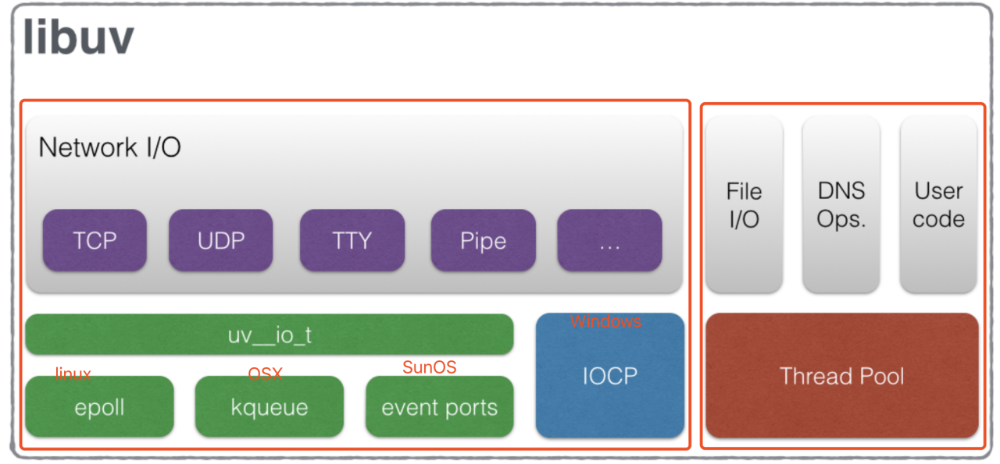
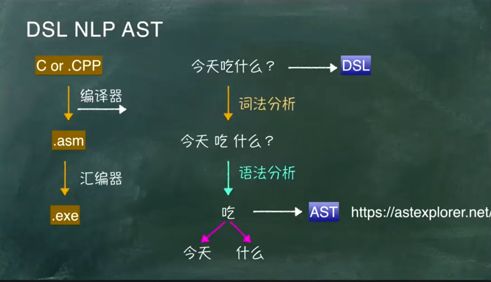
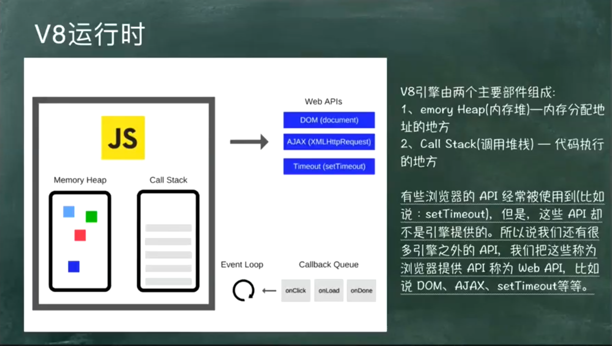
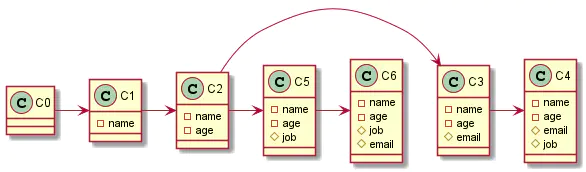
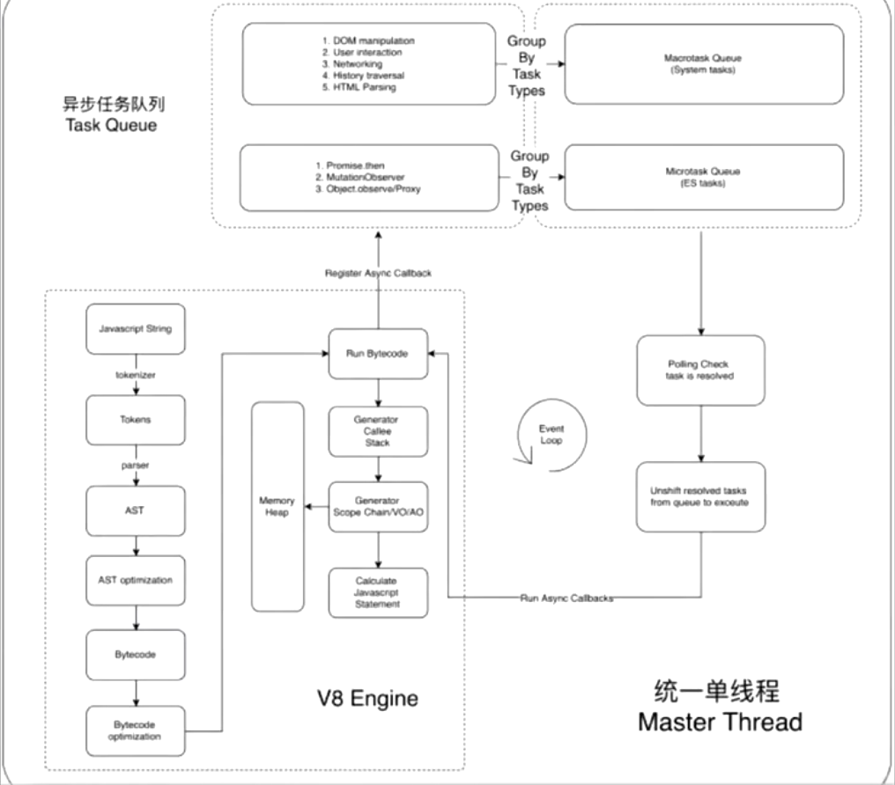

> 也许我的选择最终会被证明是错误。但至少现在，我想这样选,那么我便这样选


# Nodejs 总结

引用：github [deep-into-node]

## Node 架构

Node 架构图如下：


Nodejs 主要分为四大部分：

- 第一层： Node Standard Library： 是我们每天都在用的标准库，如 Http, Buffer 模块
- 第二层：Node Bindings ： 是沟通 JS 和 C++的桥梁，封装 V8 和 Libuv 的细节，向上层提供基础 API 服务
- 第三层 这一层是支撑 Node.js 运行的关键，由 C/C++ 实现
  - V8 是 Google 开发的 JavaScript 引擎，提供 JavaScript 运行环境，可以说它就是 Node.js 的发动机
  - Libuv 是专门为 Node.js 开发的一个封装库，提供跨平台的异步 I/O 能力
  - C-ares：提供了异步处理 DNS 相关的能力
  - http_parser、OpenSSL、zlib 等：提供包括 http 解析、SSL、数据压缩等其他的能力

后面我们可以重点聊聊 Libuv 和 v8

## Node 的 Lib 与 Event Loop

### Libuv

最早是 Libev，但是 node 慢慢流行起来后要兼容 windows 平台，但是 libev 只能在 unix 环境下运行，所以就将能在 windows 上使用的事件通知机制的 IOCP 也包容进来，由平台决定使用 libev 或 IOCP，慢慢的再将 libev 移除

即便是当下非常快的 SSD，相较高速的 CPU，依然是慢速设备。

`Libuv这样的基于事件驱动的IO模型就是为了解决高速设备同步等待慢速设备或访问的问题` 且 libuv 统一了网络访问，文件访问做到跨平台



### Node Event Loop

Node 中的 Event Loop 和浏览器中的是完全不相同的东西

在 Node 的运行环境中：

- 我们写的 js 代码会交由 V8 引擎进行处理
- 代码中可能会调用 NodeApi，node 会交由 libuv 处理
- libuv 通过阻塞 I/O 和多线程实现异步 I/O
- 然后通过事件驱动的方式，将结果放到事件队列中，最终交给我们的应用。

其实本质是在 libuv(一个高性能的，事件驱动的 I/O 库)内部有这样一个事件环机制。在 Node 启动时会初始化事件环。


Node 的 Event Loop 分为 6 个阶段，它们会`按照顺序反复运行`。每当进入某一个阶段的时候，都会从对应的回调队列中取出函数去执行。当队列为空或者执行的回调函数数量到达系统设定的阈值，就会进入下一阶段。

#### 宏任务

- timer

  timers 阶段会执行 `setTimeout 和 setInterval` 回调，并且是由 poll 阶段控制的

  同样，在 Node 中定时器指定的时间也不是准确时间，只能是尽快执行。

- I/O

  I/O 阶段会处理一些上一轮循环中的`少数未执行的 I/O 回调`

- idle, prepare

  队列的移动，仅内部使用

- poll

  poll 是一个至关重要的阶段，这一阶段中，系统会做两件事情

  1. 回到 timer 阶段执行回调
  2. 执行 I/O 回调

  并且在进入该阶段时如果没有设定了 timer 的话，会发生以下两件事情

  - 如果 poll 队列不为空，会遍历回调队列并同步执行，直到队列为空或者达到系统限制
  - 如果 poll 队列为空时，会有两件事发生

    - 如果有 setImmediate 回调需要执行，poll 阶段会停止并且进入到 check 阶段执行回调
    - 如果没有 setImmediate 回调需要执行，会等待回调被加入到队列中并立即执行回调，这里同样会有个超时时间设置防止一直等待下去

    当然设定了 timer 的话且 poll 队列为空，则会判断是否有 timer 超时，如果有的话会回到 timer 阶段执行回调。

- check

  执行 setImmediate 回调

- close callbacks

  close callbacks 阶段执行 close 事件，例如 socket.on("close",func)

#### 微任务

上面介绍的都是 macrotask 的执行情况，对于 microtask 来说，它会在以上每个阶段完成前清空 microtask 队列，下图中的 Tick 就代表了 microtask


#### process.nextTick

这个函数其实是独立于 Event Loop 之外的，它有一个自己的队列，当每个阶段完成后，如果存在 nextTick 队列，就会清空队列中的所有回调函数，并且优先于其他 microtask（微任务） 执行。

最后通过几个例子来总结下：

**案例一**

```js
setTimeout(() => {
  console.log("setTimeout");
}, 0);
setImmediate(() => {
  console.log("setImmediate");
});
```

对于以上代码来说，setTimeout 可能执行在前，也可能执行在后

- 进入事件循环也是需要成本的，如果在准备时候花费了大于 1ms 的时间，那么在 timer 阶段就会直接执行 setTimeout 回调
- 那么如果准备时间花费小于 1ms，那么就是 setImmediate 回调先执行了
- 即在执行 timers 阶段时，setTimeout 可能还没准备好，就等于先执行了 check, 再执行了第二遍 timers

**案例二**

```js
const fs = require("fs");

fs.readFile(__filename, () => {
  setTimeout(() => {
    console.log("timeout");
  }, 0);
  setImmediate(() => {
    console.log("immediate");
  });
});
```

在上述代码中， `setImmediate` 永远先执行。因为两个代码写在 IO 回调中，IO 回调是在 poll 阶段执行，当回调执行完毕后队列为空，发现存在 `setImmediate` 回调，所以就直接跳转到 check 阶段去执行回调了。

**案例三**

```js
setTimeout(() => {
  console.log("timer21");
}, 0);

Promise.resolve().then(function () {
  console.log("promise1");
});

process.nextTick(() => {
  console.log("nextTick");
  process.nextTick(() => {
    console.log("nextTick");
    process.nextTick(() => {
      console.log("nextTick");
      process.nextTick(() => {
        console.log("nextTick");
      });
    });
  });
});
```

对于以上代码来说，其实和浏览器中的输出是一样的，microtask(微任务) 永远执行在 macrotask（宏任务） 前面。
并且 nextTick 在微任务前面

**案例四**

```js
setImmediate(() => {
  console.log("setImmediate1");
  setTimeout(() => {
    console.log("setTimeout1");
  }, 0);
});
Promise.resolve().then((res) => {
  console.log("then");
});
setTimeout(() => {
  process.nextTick(() => {
    console.log("nextTick");
  });
  console.log("setTimeout2");
  setImmediate(() => {
    console.log("setImmediate2");
  });
}, 0);
```

上面执行的顺序是：then、setTimeout2、nextTick、setImmediate1、setImmediate2、setTimeout1， 为什么一定是 setTimeout 比 setImmediate 先执行呢？

因为有一个微任务 promise 在前面，promise 执行完后会进入 EventLoop 的 timers 阶段，timers 阶段会先执行 setTimout

## V8 的简单了解

V8 参考：https://zhuanlan.zhihu.com/p/96969423

这个很难讲，在讲 V8 之前，先介绍一些概念方便后面的理解：

### AST, 字节码， 机器码

- AST 抽象语法树，abstract syntax tree），是源代码的抽象语法结构的树状表现形式。

- 字节码：是一种包含执行程序，的二进制文件，是一种中间码。字节码通常不像源码一样可以让人阅读，而是编码后的数值常量、引用、指令等构成的序列。 字节码主要为了实现特定软件运行和软件环境，与硬件环境无关， 字节码的实现方式是通过编译器和虚拟机器编译器将源码编译成字节码，特定平台上的虚拟机器将字节码转译为可以直接执行的指令

- 机器码：是电脑的 CPU 可直接解读的数据，是计算机可以直接执行，并且执行速度最快的代码


### 词法分析 & 语法分析

- 词法分析（Lexical analysis）：编译过程的第一个阶段，这个阶段的任务是从左到右一个字符一个字符地读入源程序，即对构成源程序的字符流进行扫描然后根据构词规则识别单词

-  语法分析 (Syntax analysis): 语法分析是编译过程的一个逻辑阶段, 语法分析的任务是在词法分析的基础上将单词序列组合成各类语法短语,语法分析程序判断源程序在结构上是否正确.源程序的结构由上下文无关文法描述



### V8结构图

#### v8运行时的结构图



#### v8运行流程图


- 词法分析：源码通过词法分析将其中的字符串分割出来，生成一系列的token, （有 字符串&符合 与 token的映射表）

- 语法分析：将词法分词解构出来的token转化为AST抽象语法树，当程序出现语法错误的时候，V8在语法分析阶段抛出异常

- 根据抽象语法树生成字节码（BytecodeGenerator）
BytecodeGenerator类的作用是根据抽象语法树生成对应的字节码

- 生成字节码，那字节码如何执行的呢？ 
借助Ignition（点火器）配合TurboFan，

    Ignition是V8（新v8,老v8不是这样的）的字节码解释器，对比老V8，它提高了性能，节约了内存。

    TurboFan是V8的优化编译器，Ignition的字节码可以直接用TurboFan生成优化的机器代码

    Ignition+TurboFan架构比Full-codegen+Crankshaft架构（老架构）内存降低一半多

    Ignition+TurboFan架构比Full-codegen+Crankshaft架构70%网页速度是有提升的。

### v8的高效小秘密

#### 隐藏类与内联缓存

对于动态类型语言来说，由于类型的不确定性，在方法调用过程中，语言引擎每次都需要进行动态查询，这就造成大量的性能消耗，从而降低程序运行的速度。大多数的Javascript 引擎会采用哈希表的方式来存取属性和寻找方法。而为了加快对象属性和方法在内存中的查找速度

hidden class 隐藏类：在初始化对象的时候，V8引擎会创建一个隐藏类，随后在程序运行过程中每次增减属性，就会创建一个新的隐藏类或者查找之前已经创建好的隐藏类。每个隐藏类都会记录对应属性在内存中的偏移量，从而在后续再次调用的时候能更快地定位到其位置。



> tips: 不同初始化顺序的对象，所生成的隐藏类是不一样的

内联缓存技术来优化运行时查找对象及其属性的过程。对于同一方法的重复调用往往发生在同一类型的对象上

他们之间如何关联？ 

无论何时在特定对象上调用方法时，V8必须执行对该对象的隐藏类的查找，在同一个隐藏类的两次成功调用后，V8省略隐藏类的查找，并简单的将该属性的偏移量添加到对象指针本身。

```js
var arr = [1, 2, 3, 4];
arr.forEach((item) => console.log(item.toString());
```
像上面这段代码，数字1在第一次toString()方法时会发起一次动态查询，并记录查询结果。当后续再调用toString方法时，引擎就能根据上次的记录直接获知调用点，不再进行动态查询操作。

```js
var arr = [1, '2', 3, '4'];
arr.forEach((item) => console.log(item.toString());
```

调用toString方法的对象类型经常发生改变，这就会导致缓存失效。为了防止这种情况发生，V8引擎采用了 polymorphic inline cache (PIC) 技术， 该技术不仅仅只缓存最后一次查询结果，还会缓存多次的查询结果（取决于记录上限）


**Tips**

v8调试技巧：
- --trace-opt-verbose 执行细节
- --trace-gc 查看内存占用
- --allow-natives-syntax 允许使用v8本身的语法

```js
// test.js
function ClassDemo(val) {
    this.prop = val
}

var a = new ClassDemo('123')
var b = new ClassDemo('456')

console.log(%HaveSameMap(a,b)) // true

b.prop2 = '789'
console.log(%HaveSameMap(a,b)) // false

// node --allow-natives-syntax test.js
```


## 垃圾回收

## Chrome V8 垃圾回收机制 （分代式垃圾回收机制）

V8 的垃圾回收策略基于分代回收机制，该机制有两个假说为依据：

- 大部分新生对象倾向于早死
- 不死的对象，会活得更久

### V8 的内存分代

在 V8 中，将内存分为了新生代（new space）和老生代（old space）。它们特点如下

- 新生代：对象的存活时间较短。新生对象或只经过一次垃圾回收的对象
- 老生代：对象存活时间较长。经历过一次或多次垃圾回收的对象

V8 堆的空间等于新生代空间加上老生代空间。我们可以通过`--max-old-space-size`命令设置老生代空间的最大值，`--max-new-space-size` 命令设置新生代空间的最大值

默认设置下，新老生代的内存如下：

| 类型\系统位数           | 64 位  | 32 位 |
| ----------------------- | ------ | ----- |
| 老生代                  | 1400MB | 700M  |
| reserved_semispace_size | 16M    | 8M    |
| 新生代                  | 32M    | 16M   |

(新生代，它由两个 reserved_semispace_size 组成 )

#### Stop The World （全停顿）
  垃圾回收算法在执行前，需要将应用逻辑暂停，执行完垃圾回收后再执行应用逻辑，这种行为称为 「全停顿」（Stop The World）。例如，如果一次 GC 需要 50ms，应用逻辑就会暂停 50ms

#### 新生代

新生代中的对象主要通过 Scavenge 算法进行垃圾回收。Scavenge 的具体实现，主要采用了 Cheney 算法。

Cheney 算法将内存一分为二, 每个空间称为 semispace，一个处于使用中（Form），一个处于闲置中(To)

流程如下：

- 从 From 空间分配对象，若 semispace 被分配满，则执行 Scavenge 算法进行垃圾回收
- 检查 From 空间的存活对象，若对象存活，则检查对象是否符合晋升条件，若符合条件则晋升到老生代，否则将对象从 From 空间复制到 To 空间
- 若对象不存活，则释放不存活对象的空间
- 完成复制后，将 From 空间与 To 空间进行角色翻转（flip）【即form变to, to变form】

对象晋升条件

- 对象是否经历过 Scavenge 回收。对象从 From 空间复制 To 空间时，会检查对象的内存地址来判断对象是否已经经过一次 Scavenge 回收。若经历过，则将对象从 From 空间复制到老生代中；若没有经历，则复制到 To 空间

- To 空间的内存使用占比是否超过限制。当对象从 From 空间复制到 To 空间时，若 To 空间使用超过 25%，则对象直接晋升到老生代中。设置为 25%的比例的原因是，当完成 Scavenge 回收后，To 空间将翻转成 From 空间，继续进行对象内存的分配。若占比过大，将影响后续内存分配。

新生代算法的优缺点：
它的缺点是只能使 用堆内存的一半，这是一个典型的空间换时间的办法， 但是新生代声明周期较短，恰恰就适合这个算法

#### 老生代

老生代中的对象有两个特点，第一是存活对象多，第二个存活时间长。若在老生代中使用 Scavenge 算法进行垃圾回收，将会导致复制存活对象的效率不高，且还会浪费一半的空间。因而，V8在老生代采用Mark-Sweep 和 Mark-Compact 算法进行垃圾回收

- Mark-Sweep【标记清除的意思。它主要分为标记和清除两个阶段】
    - 标记阶段，它将遍历堆中所有对象，并对存活的对象进行标记
    - 清除阶段，对未标记对象的空间进行回收
    - 问题：但是清除过 后出现内存不连续的情况，这样会对后续大对象的内存分配造成问题，没有任何一个碎片内支持分配，这将提前触发一次垃圾回收

- Mark-Compact 【标记整理 算法】
它是基于 Mark-Sweep 演变而来的，标记阶段和额Mark-Seep逻辑一致，但在清除阶段它先将活着的对象移到一边，移动完成后，直接清理边界外的内存。

TIPS：由于Mark-Compact需要移动对象，所以执行速度上，比Mark-Sweep要慢。所以，V8主要使用Mark-Sweep算法，然后在当空间内存分配不足时，采用Mark-Compact算法。

#### Incremental Marking（增量标记）
在新生代中，由于存活对象少，垃圾回收效率高，全停顿时间短，造成的影响小。但是老生代中，存活对象多，垃圾回收时间长，全停顿造成的影响大。为了减少全停顿的时间，V8对标记进行了优化，将一次停顿进行的标记过程，分成了很多小步。每执行完一小步就让应用逻辑执行一会儿，这样交替多次后完成标记。从2011年起，v8就将「全暂停」标记换成了增量标记

#### lazy sweeping（延迟清理）
- 发生在增量标记之后
- 堆确切地知道有多少空间能被释放
- 延迟清理是被允许的，因此页面的清理可以根据需要进行清理
- 当延迟清理完成后，增量标记将重新开始


## 完整的结构图

