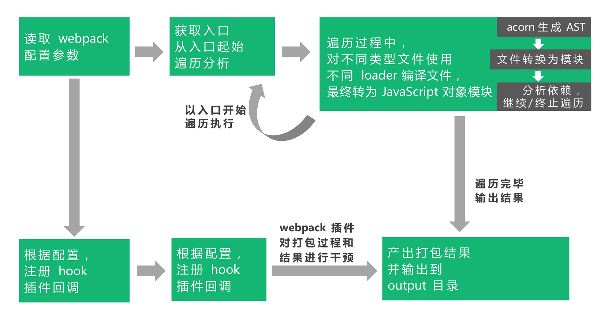
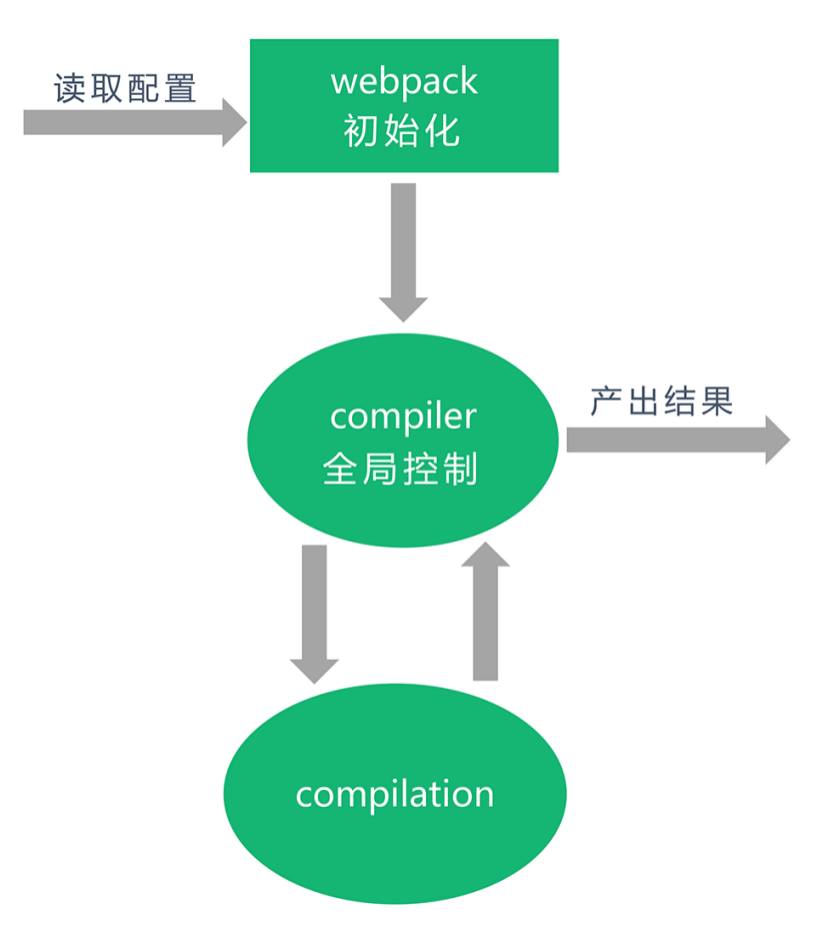

## ES6 模块化（静态）& Tree sharking

ES 的模块化和 Commonjs 的区别

- ES 模块的设计思想是尽量 静态化，这样能保证在编译时就确定模块之间的依赖关系，每个模块的输入和输出变量也都是确定的。CommonJS 和 AMD 模块，无法保证前置即确定这些内容，只能在运行时确定。
- CommonJS 模块输出的是一个值的 拷贝 ，ES 模块输出的是值的 引用。

```js
// ===> es module
// lib.js
export let data = "data";
export function modifyData() {
  data = "modified data";
}

// index.js
import { data, modifyData } from "./lib.js";
console.log(data); // data
modifyData();
console.log(data); // modified data
```

```js
// ===> commonjs
// lib.js
let data = "data";
function modifyData() {
  data = "modified data";
}
module.exports = {
  data,
  modifyData,
};

// index.js
const { data, modifyData } = require("./lib");
console.log(data); // data
modifyData();
console.log(data); // data
```

因为 CommonJS 是输出了值的拷贝，而非引用，因此在调用 modifyData 之后，index.js 的 data
值并没有发生变化，其值为一个全新的拷贝。

之前写过 commonjs 的导入逻辑，相当于“函数传值”，赋值变量给 exports, 如果 data 是 object 类型的话，修改其属性值，相比于 string, 值是会变化的

### ES 模块化为什么设计成静态

ES 模块化的静态性带来了限制：

- 只能在文件顶部 import 依赖
- import 的模块名只能是字符串常量，即不可以动态确定依赖
- export 导出的变量类型严格限制

这样的限制在语言层面带来的便利之一是：我们可以通过作用域分析，分析出代码里变量所属的作用域以及它们之间的引用关系，进而可以推导出变量和导入依赖变量的引用关系，在没有明显引用时，就可以进行去冗余。

### tree sharking

在计算机科学当中，一个典型去除无用代码、冗余代码的手段是
[DCE](https://en.wikipedia.org/wiki/Dead_code_elimination)，dead code
elimination 清楚死代码

#### DEC 和 Tree-sharking 的区别

Dead Code 的特征：

- 代码不会被执行，不可到达
- 代码执行的结果不会被用到
- 代码只会影响死变量（只写不读）

DEC 中一般是打包完成后再去分析代码中是否存在 Dead Code，并清楚。比如 `uglify`插件就完成了 DEC 的功能

Tree-sharking 则是先去除掉没有引用的代码，再去打包。某种意义上来说，tree-sharking 是广义的 DEC

但是 tree-sharking 目前还存在不少问题

- 只处理函数和顶层的 import/export 变量，不能把没用到的类的方法消除掉
- 具有副作用的脚本无法被优化。

这是由于 javascript 动态语言的特性导致的，使得静态分析比较困难。

### 在浏览器中[快速]使用 ES 模块化

目前各大浏览器较新版本都已经开始逐步支持 ES 模块了。如果我们想在浏览器中使用原生 ES 模块方案，只需要在 script 标签上添加一个
type="module" 属性。通过该属性，浏览器知道这个文件是以模块化的方式运行的。而对于不支持的浏览器，需要通过 nomodule 属性来指定某脚本为
fallback 方案：

```js
 <script type="module">
    import module1 from './module1'
</script>
<script nomodule>
    alert('你的浏览器不支持 ES 模块，请先升级！')
</script>
```

### 在 Node.js 中使用 ES 模块化(目前没什么大用)

Node.js 从 9.0 版本开始支持 ES 模块，执行脚本需要启动时加上 --experimental-
modules，不过这一用法要求相应的文件后缀名必须为 \*.mjs：

```js
node --experimental-modules module1.mjs
```

另外，也可以安装 babel-cli 和 babel-preset-env，配置 .babelrc 文件后，执行：

```sh
./node_modules/.bin/babel-node
# 或者
npx babel-node
```

## webpack 深度剖析

这个阶段我们可以来看看 webpack 内部的打包逻辑和方式

在了解内部逻辑之前，我们要先了解一些概念：

- Webpack 本质上是一种事件流的机制，它的工作流程就是将各个插件串联起来，而实现这一切的核心就是 Tapable，webpack 中最核心的负责编译的 Compiler 和负责创建 bundle 的 Compilation 都是 Tapable 的实例。
- 通过事件和注册和监听，触发 webpack 生命周期中的函数方法

### webpack 将代码编译成了什么？

具体分析查看 `./code/02-webpack-core` 目录中的 dist 中的内容会对打包的代码做比较详细的描述，其实主体上就是一个 自执行函数 配置 node 中理解的 commonjs 模块的实现

### webpack 工作原理



大体流程如下：

- 首先，webpack 会读取项目中由开发者定义的 webpack.config.js 配置文件，或者从 shell 语句中获得必要的参数。这是 webpack 内部接收业务配置信息的方式。这就完成了配置读取的初步工作。
- 接着，实例化所需 webpack 插件，在 webpack 事件流上挂载插件钩子，这样在合适的构建过程中，插件具备了改动产出结果的能力。
- 同时，根据配置所定义的入口文件，以入口文件（可以不止有一个）为起始，进行依赖收集：对所有依赖的文件进行编译，这个编译过程依赖 loaders，不同类型文件根据开发者定义的不同 loader 进行解析。编译好的内容使用 acorn 或其它抽象语法树能力，解析生成 AST 静态语法树，分析文件依赖关系，将不同模块化语法（如 require）等替换为 `__webpack_require__`，即使用 webpack 自己的加载器进行模块化实现。
- 上述过程进行完毕后，产出结果，根据开发者配置，将结果打包到相应目录。

在这整个打包过程中， **webpack 和插件采用基于事件流的发布订阅模式，监听某些关键过程，在这些环节中执行插件任务**

上述过程可以总结为更精炼 - 模块经历的主要流程

**加载** （loaded） 、 **封存** （sealed）、 **优化**
（optimized）、 **分块** （chunked）、 **哈希** （hashed）和 **重新创建**
（restored）

---

webpack 加载原理中一些重要的概念

#### 抽象语法树

在 Nodejs 总结中有过描述，不再细说。

**webpack 将文件转换成 AST 的目的就是方便开发者提取模块文件中的关键信息。**
这样一来，我们就可以“知晓开发者到底写了什么东西”，也就可以根据这些“写出的东西”，实现分析和扩展。在代码层面，我们可以把 AST 理解为一个 object

#### compiler 和 compilation

compiler 和 compilation 这两个对象是 webpack 核心原理中最重要的概念。它们是理解 webpack 工作原理、loader 和插件工作的基础。

- compiler 对象：它的实例包含了完整的 webpack 配置，全局只有一个 compiler 实例，它类似于骨架或者神经中枢。当插件被实例化的时候, 会接收到 compiler 对象，通过它能访问 webpack 的内部环境
- complication 对象：当 webpack 以开发模式运行时，每当检测到文件的变化，一个新的 compliation 对象将被创建，这个对象包含了当前的模块资源，编译生成的资源，变化的文件等许晓，也就是说，所有构建过程中产生的数据都存储在该对象上，它也掌握着构建过程中的每一个环节，同时它也提供了很对事件回调给插件做扩展



综上：webpack 的构建过程是通过 compiler 控制流程，compilation 进行解析。 **在开发插件时，我们可以从 compiler
对象中拿到所有和 webpack 主环境相关的内容，包括事件钩子。**

compiler 对象和 compilation 对象都继承自 tapable，tapable.js 这个库暴露了所有和事件相关的 pub/sub
的方法。webpack 基于事件流的 tapable 库，不仅能保证插件的有序性，还使得整个系统扩展性更好。

#### tapable

tapable 是一个控制钩子函数的发布与订阅的第三方库，它内部提供了很多不同的钩子（hook）

Hook 类型可以分为`同步Sync和异步Async，异步又分为并行和串行`

| 类型      | 特点                                                                                      |
| --------- | ----------------------------------------------------------------------------------------- |
| Basic     | 不关心监听函数的返回值                                                                    |
| Bail      | 保险式: 只要监听函数中有返回值(不为 undefined)，则跳过之后的监听函数                      |
| Waterfall | 瀑布式: 上一步的返回值交给下一步使用                                                      |
| Loop      | 循环类型: 如果该监听函数返回 true,则这个监听函数会反复执行，如果返回 undefined 则退出循环 |
| Parallel  | 并行执行钩子                                                                              |
| Series    | 串行执行钩子                                                                              |


> 具体的代码可参考 code/03-tapable

关于更细节的内容，后面有点地方会提到，最后贴上一张 webpack 内部架构图：


---

### webpack 源码分析

#### webpack 流程图解

webpack 版本的差异可能会导致流程图不一定一致，但总体思路是不变的


[详细的流程图](./webpack-process.md)

#### webpack debug

现在在 vscode 上调试代码已经很方便了，直接在 `package.json`的 script 上面添加脚本，在 webpack 入口文件 `node_modules/webpack-cli/bin/cli.js`打上断点就可以了, 调试过程中我们可以结合上面的流程图，依次进行对照和分析

- 先折叠无关的分支的逻辑，只看主体流程代码
- 寻找关键路径，根据变量名和方法名猜测意图，然后通过阅读源码来验证想法
- debugger 关键路径，理解整个执行过程

> 02-build-source 文件夹下的当前 webpack 版本的构建行代码

```js
// ==> webpack-cli/bin/cli.js - 71行
options = require("./utils/convert-argv")(argv); // 获取用户输入的参数，读取webpack配置文件

// ==> webpack-cli/bin/cli.js - 272行
compiler = webpack(options); // 实例化 Compiler
  // webpack/bin/Compiler.js 45行
  this.hooks = {...} // Compiler构造函数中生成了一系列的钩子对象

// ==> cli.js 353行 ---> Compiler.js - 247行
compiler.run // 开始编译

// ==> Compiler.js 312行
this.hooks.beforeRun.callAsync // beforeRun钩子调用
this.hooks.run.callAsync // run 钩子调用

// ==> Compiler.js 660行
this.compile() // 该事件是为了告诉插件一次新的编译将要启动，同时会给插件传入compiler 对象。
  // ==> Compiler.js 667行
  this.newCompilation(params) // 当 Webpack 以开发模式运行时，每当检测到文件变化，一次新的 Compilation 将被创建。
    // ===> Complication.js 250行
    this.hooks = {...} // Complication构造函数中生成的一系列的钩子对象

  this.hooks.make.callAsync // 一个新的 Compilation 创建完毕开始编译
    // ===> Complication.js 1142行
    compilation.addEntry  this._addModuleChain // 即将从 Entry 开始读取文件
    // ===> Complication.js 1055行
    const moduleFactory = this.dependencyFactories.get(Dep); // 创建模块工厂
    // ===> Complication.js 1063行
    moduleFactory.create // 创建模块

    // ===> NormalModuleFactory
    factory(result, (err, module) // 开始创建模块
    resolveRequestArray // 解析loader路径
    _run // 它可以根据模块路径名，匹配出模块所需的loader
    this.getParser(type, settings.parser) // 	获取AST解析器

    // ===> Complication 1232行
    this.buildModule(module...) // 开始编译模块

    // ===> NormalModule
    build(options...)// 开始真正编译入口模块
    this.createSource // 创建源代码对象
    this.parser.parse // 使用parser转换抽象语法树

    // ===> Complication
    this.hooks.succeedModule.call(module) // 生成语法树后就表示一个模块编译完成
    this.processModuleDependencies(module // 	递归编译依赖的模块

  // ===> Complier
  compilation.finish(); // 递归完成

  compilation.seal  // 封装
  addChunk(name) // 生成资源
  source = fileManifest.render(); // 渲染源码
  this.hooks.afterCompile // 编译结束
  this.hooks.shouldEmit // 所有需要输出的文件已经生成好，询问插件哪些文件需要输出，哪些不需要
  this.emitRecords // 	写入记录
  this.hooks.done.callAsync //全部完成
```

---

### webpack loader

#### loader 简介

上面属性了大概的概念。我们可以试着自己去编写一个 loader

**loader 就是接受源文件，对源文件进行处理，返回编译后文件**

```js
module.exports = {
    ...
    module: {
        rules: [{
            test: /\.less$/,
            use: [{
            loader: 'style-loader' // 通过 JS 字符串，创建 style node
            }, {
            loader: 'css-loader' // 编译 css 使其符合 CommonJS 规范
            }, {
            loader: 'less-loader' // 编译 less 为 css
            }]
        }]
   }
}
```

当我们调用多个 loader 串联去转换一个文件时，每个 loader 会链式地顺序执行。webpack 中，在同一文件存在多个匹配 loader 的情况下，遵循以下原则：

- loader 的执行顺序是和配置顺序相反的，即配置的最后一个 loader 最先执行，第一个 loader 最后执行。
- 第一个执行的 loader 接收源文件内容作为参数，其他 loader 接收前一个执行的 loader 的返回值作为参数。最后执行的 loader 会返回最终结果

**因此，在你开发一个 loader 时，请保持其职责的单一性，只需关心输入和输出。**

#### loader 技术点

(1) loader 的本质就是函数，最简单的结构如下:

```js
module.exports = function (source) {
  // some magic...
  return content;
};
```

(2) 更进一步，我们知道在配置 webpack 时，对于 loader 可以增加一些配置，我们除了 source 以外，还需要根据开发者配置的 options。
**这时候就需要 loader-utils 模块了来获取 options**

```js
const loaderUtils = require("loader-utils");
module.exports = function (source) {
  // 获取开发者配置的 options
  const options = loaderUtils.getOptions(this);
  // some magic...
  return content;
};
```

(3) 再进一步，对于 loader 返回的内容，在实际开发中，单纯对 content 进行改写并返回也许是不够的，比如对错误信息的捕获或者想到处 sourceMap 信息

这种情况需要用到 loader 中的 this.callback 进行内容的返回。this.callback 可以传入四个参数，分别是：

- error：Error | null，当 loader 出错时向外抛出一个 error
- content：String | Buffer，经过 loader 编译后需要导出的内容
- sourceMap：为方便调试生成的编译后内容的 source map
- ast：本次编译生成的 AST 静态语法树，之后执行的 loader 可以直接使用这个 AST，进而省去重复生成 AST 的过程

当我们使用 `this.callback` 返回内容时，该 loader 必须返回 `undefined`，这样 webpack 就知道该
loader 返回的结果在 `this.callback` 中，而不是 return 中。

```js
module.exports = function (source) {
  // 获取开发者配置的 options
  const options = loaderUtils.getOptions(this);
  // some magic...
  // return content
  this.callback(null, content);
};
```

上面代码中的 this 是一个叫 `loaderContext` 的 loader-runner【涉及到源码】

完整的 Loader API [https://webpack.js.org/api/loaders/]

(4) 默认情况下，webpack 传给 loader 的内容源都是 UTF-8 格式编码的字符串,但有些 loader 是需要二进制文件的。

可以通过 `source instanceof Buffer === true` 来判断， 同时要再文件中显示注明: `module.exports.raw = true`

(5) 还存在异步 loader 的情况。一般可以使用如下两种解决方案

- 直接上 async-await
  ```js
  module.exports = async function (source) {
    function timeout(delay) {
      return new Promise((resolve, reject) => {
        setTimeout(() => {
          resolve(source);
        }, delay);
      });
    }
    const content = await timeout(1000);
    this.callback(null, content);
  };
  ```
- webpack 提供的 this.async，调用 this.async 会返回一个 callback，在异步完成之后，我们进行调用
  ```js
  module.exports = async function (source) {
    function timeout(delay) {
      return new Promise((resolve, reject) => {
        setTimeout(() => {
          resolve(source);
        }, delay);
      });
    }
    const callback = this.async();
    timeout(1000).then((data) => {
      callback(null, data);
    });
  };
  ```

#### 写一个真实的 loader

loader 的用法准则：

- 链式(Chaining)，利用 loader 可以链式调用的优势。写五个简单的 loader 实现五项任务，而不是一个 loader 实现五项任务
- 无状态(Stateless) 确保 loader 在不同模块转换之间不保存状态。每次运行都应该独立于其他编译模块以及相同模块之前的编译结果。
- loader 依赖(Loader Dependencies) 如果一个 loader 使用外部资源（例如，从文件系统读取），必须声明它。这些信息用于使缓存 loaders 无效，以及在观察模式(watch mode)下重编译。
- 不要在模块代码中插入绝对路径，因为当项目根路径变化时，文件绝对路径也会变化。loader-utils 中的 `stringifyRequest` 方法，可以将绝对路径转化为相对路径

常用到的第三方库和 API:

- loader-utils loader 工具库，其中一个功能是获取 option 选项
- schema-utils 配合 loader-utils，用于保证 loader 选项，进行与 JSON Schema 结构一致的校验
- this.async 异步回调处理
- this.cacheable webpack 缓存
- this.resourcePath 处理当前的文件路径
- this.addDependency 给当前处理文件添加其依赖的文件，以便再其依赖的文件发生变化时，会重新调用 Loader 处理该文件。使用方法为 addDependency(file: string)

---

### webpack plugin

在具体介绍 webpack 内置插件与钩子可视化工具之前，我们先来了解一下 webpack 中的插件机制。 webpack 实现插件机制的大体方式是：

- 创建 - webpack 在其内部对象上创建各种钩子；
- 注册 - 插件将自己的方法注册到对应钩子上，交给 webpack；
- 调用 - webpack 编译过程中，会适时地触发相应钩子，因此也就触发了插件的方法。

loader 和 plugin 的 差异

- loader 其实就是一个转换器，执行单纯的文件转换操作
- plugin 是一个扩展器，它丰富了 webpack 本身，在 loader 过程结束后，webpack 打包的整个过程中，weback plugin 并不直接操作文件，而是基于事件机制工作，监听 webpack 打包过程中的某些事件，见缝插针，修改打包结果

编写插件的开始一步就是要清楚当前插件要解决什么问题，根据问题，找到相应的钩子事件，在相关事件中进行操作，改变输出结果

- [Compiler 暴露的所有事件钩子](https://webpack.js.org/api/compiler-hooks/)
- [Compilation 暴露的所有事件钩子](https://webpack.js.org/api/compilation-hooks/)
  - compilation 是 compiler 生命周期中的一个步骤
  - compilation 暴露了与模块和依赖有关的粒度更小的钩子

一个自定义 webpack plugin 的骨架结构就是一个带有 apply 方法的 class

```js
class CustomPlugin {
  constructor(options) {
    this.options = options;
  }
  apply(compiler) {
    // 相关钩子注册回调
    compiler.hooks.someHook.tap("CustomPlugin", () => {
      // magic here...
    });

    // 打印出此时 compiler 暴露的钩子
    for (var hook of Object.keys(compiler.hooks)) {
      console.log(hook);
    }
  }
}

module.exports = customPlugin;
```

使用 compilation 相关钩子的通用写法

```js
class CustomPlugin {
  constructor(options) {
    this.options = options;
  }
  apply(compiler) {
    compiler.hooks.compilation.tap("CustomPlugin", function (
      compilation,
      callback
    ) {
      compilation.hooks.someOtherHook.tap("SomePlugin", function () {
        // some magic here
      });
    });
  }
}

module.exports = customPlugin;
```

Plugin 存在异步的写法, 我们可以使用 tapAsync 和 tapPromise 方法来处理

```js
class CustomAsyncPlugin {
  constructor(options) {
    this.options = options;
  }
  apply(compiler) {
    compiler.hooks.emit.tapAsync("CustomAsyncPlugin", function (
      compilation,
      callback
    ) {
      setTimeout(() => {
        callback();
      }, 1000);
    });

    compiler.hooks.emit.tapPromise("CustomAsyncPlugin", function (
      compilation,
      callback
    ) {
      return asyncFun().then(() => {
        //...
      });
    });
  }
}
```
