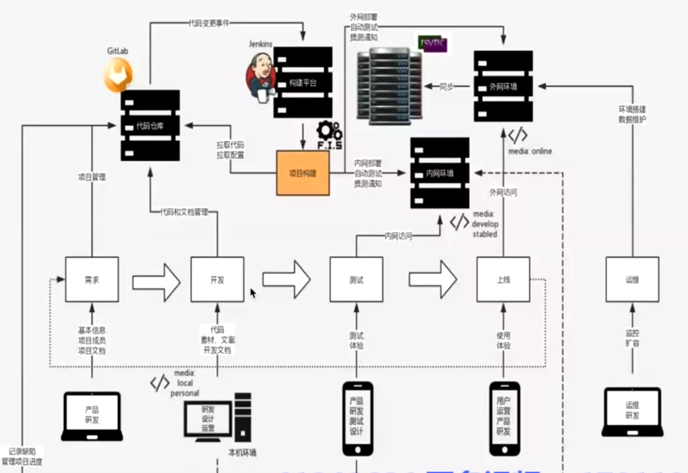

准确来说应该是前端的工程化，工程化的最终目的是让多人协作更容易，开发更统一规范，效率更高
就像纯函数一样，相同的输入最终一定是一样的输出

自动化这块用到的东西的适用的不仅仅是前端的部分, 包括后端部分

下面是个相对粗糙的整个工程化的流程图,包含了软件全生命周期中，自动化的一条暗线



描述部分如下：

- 统一代码仓库通过分支管理，主干合并 （SVN, GIT...）
- 自动化构建工具，编译，部署，测试，监控，本机开发线上环境
  - 构建：webpack, rollup..
  - 测试：chai, mocha...
  - 持续集成平台：Jenkins, Travs CI...
  - 部署工具：rsync, shelljs, yargs...

## 大型前端项目的组织设计

**团队中一般不止有一个业务项目，多个项目之间如何配合，如何维护相互关系？公司自己的公共库版本如何管理？这些话题随着业务扩展，纷纷浮出水面**

一个现实的例子：

团队主业务项目名为：App- project，这个仓库依赖了组件库：Component-lib，因此 App-project 项目的 package.json 会有类似的代码：

```json
{
  "name": "App-project",
  "version": "1.0.0",
  "dependencies": {
    "Component-lib": "^1.0.0"
  }
}
```

这时新的需求来了，产品经理需要更改 Component-lib 组件库中的 modal 组件样式及交互行为。作为开发者，我们需要切换到 Component- lib 项目，进行相关需求开发，开发完毕后进行测试。这里的测试包括 Component-lib 当中的单元测试，当然也包括在实际项目中进行效果验收。为方便调试，有经验的开发者也许会使用 npm link/yarn link 来开发和调试效果。当确认一切没问题后，我们还需要 npm 发包 Component-lib 项目，并提升版本为 1.0.1。在所有这些都顺利完成的基础上，才能在 App-project 项目中进行升级：

```json
{
  //...
  "dependencies": {
    "Component-lib": "^1.0.1"
  }
}
```

这个过程已经比较复杂了。如果中间环节出现任何纰漏，我们都要重复上述所有步骤。现实中 App-project 不可能只依赖 Component-lib。这种项目管理的方式无疑是低效且痛苦的

### monorepo 和 multirepo

组织代码的方式主要分为两种

- multirepo 应用按照模块分别在不同的仓库中进行管理，即上述 App-project 和 Component-lib 项目的管理模式

  存在的问题：

  - 开发调试以及版本更新效率低下
  - 团队技术选型分散，不同的库实现风格可能存在较大差异
  - 管理混乱

- monorepo 将应用中所有的模块一股脑全部放在同一个项目中

  存在的问题

  - 库体积超大，目录结构复杂度上升
  - 需要使用维护 monorepo 的工具，这就意味着学习成本比较高

没有用过，但是看文章作者和社区更倾向于使用 monorepo【都放在一起】，但是monorepo不是一股脑的将所有的代码都堆在一起这么简单，它是螺旋上升的更高级别的处理方法

monorepo的优势：
- 所有项目拥有一致的 lint，以及构建、测试、发布流程
- 不同项目之间容易调试、协作
- 容易初始化开发环境
- 易于发现 bug

### 使用 Lerna 实现 monorepo
Lerna 是 Babel 管理自身项目并开源的工具

一个初始化的Lerna的monorepo的项目结构类似如下：
```
packages/
  module-1/
    package.json
  module-2/
    package.json
  module-3/
    package.json
```

Lern中一些常用的指令
```sh
#  lerna bootstrap 命令会建立整个项目内子 repo 之间的依赖关系，这种建立方式不是通过“硬安装”，而是通过软链接指向相关依赖
lerna bootstrap

# 这条命令将各个 package 一步步发布到 npm 当中。Lerna 还可以支持自动生成 changelog 等功能
lerna publish

# 也可以使用 Lerna 安装依赖，该命令可以在项目下的任何文件夹中执行
lerna add dependencyName
```

monorepo 目前来看会是一个流行趋势，但具体的落地估计还需要结合实际情况灵活运用，而且也会带来很多新的问题，这些都是需要一步一步走出来的坑
