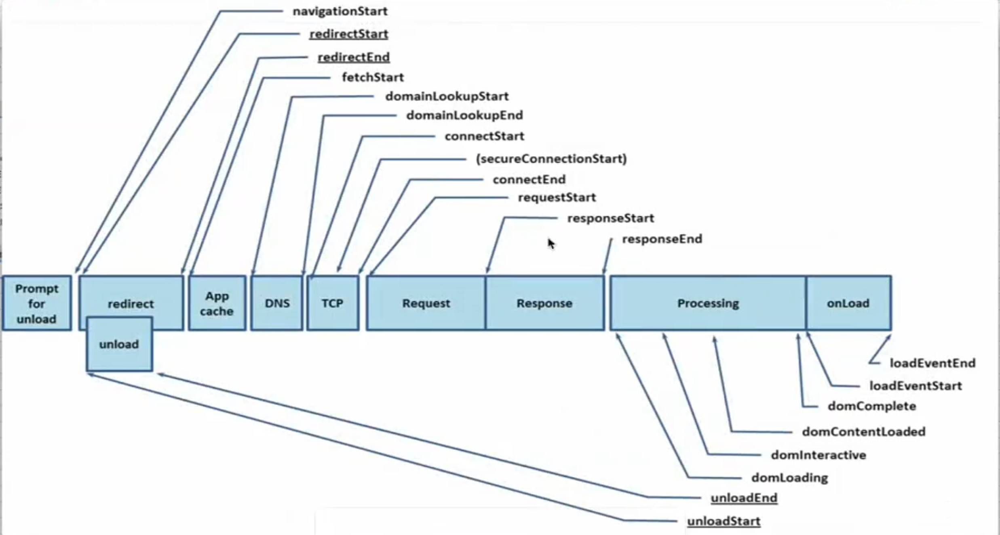
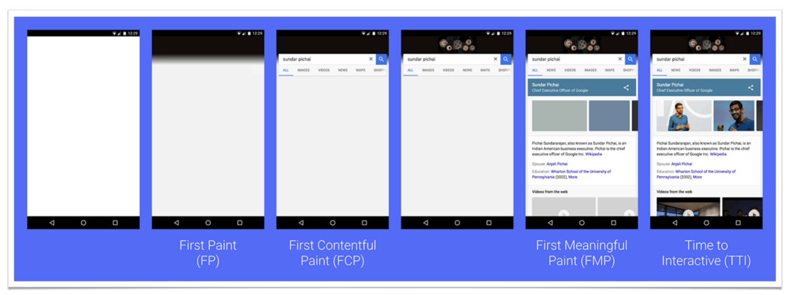
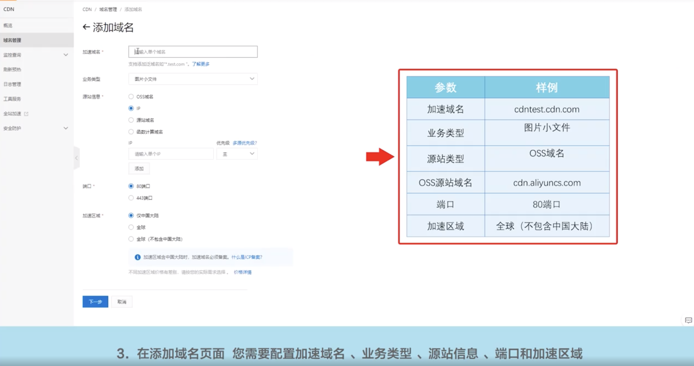
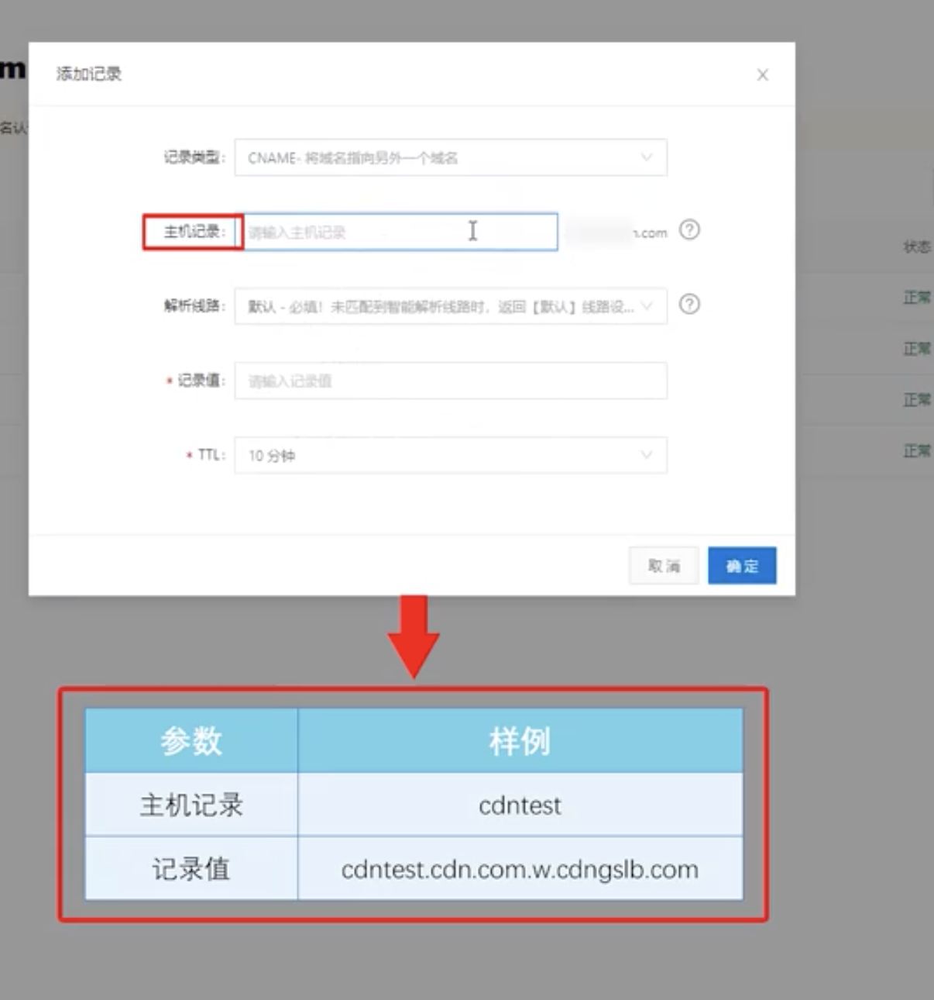

> 言尽于此，愿君之勿忘也 ······ 临颖神驰，书不成字，纸短情长，伏惟珍重 - 徐枕亚《玉梨魂》

这个真的是一个很大的话题额....

参考文档:

- https://juejin.im/post/6844903839863144461
- https://developers.google.cn/web/tools/chrome-devtools/evaluate-performance?hl=zh-cn
- https://developers.google.cn/web/fundamentals/performance/get-started
- https://www.ruanyifeng.com/blog/2015/09/web-page-performance-in-depth.html
- https://web.dev/fast/

性能优化是前端的重要课题，实实在在影响产品性能。前端性能也是一个太过宽泛的话题，脱离场景和需求谈性能往往毫无意义。 具体的实践必须结合实际的场景和需求来看

## 概述

为什么要考虑性能？

- 性能是留住用户重要指标
- 性能就是提高用户转化率
- 性能是提高用户体验
- 性能高能节约人的成本

web 性能优化名言：

- 讨论性能时务求精确，以免产生误解或散布谬见，从而导致出于善意的开发者朝着错误的方向优化，最终影响而不是改善用户体验。

- 加载并非单一的时刻，而是一种任何单一指标都无法全面衡量的体验。 在加载过程中，有多个时刻都会影响到用户对速度的感知，如果只关注其中某个时刻，就可能会遗漏其余时间内用户感受到的不良体验

- 我们不应该只使用一个指标来重新加载，而应该衡量整个体验过程中可能影响用户对加载的感知的每个时刻

- 性能谬见的另一个示例是性能只是加载时间的问题，大部分性能工具仅衡量加载性能也会将这个错误放大。事实是，随时都有可能发生性能不佳的情况，不只限于加载期间。 应用无法迅速响应点按或点击操作，以及无法平滑滚动或产生动画效果的问题与加载缓慢一样，都会导致糟糕的用户体验。 用户关心的是总体体验，我们开发者也应如此

## 宏观预览

前面有介绍过从网络和浏览器的角度，输入一个 URL 发生了上面。现在就将从新的角度看输入 URL 发生了什么，以此引导出一个页面加载的不同阶段，每个阶段能够优化的地方。



图片中一共有 9 大步，每一步都对应一段操作：

> 1-3 缓存和准备工作 4-7 网络操作 8-9 数据获取后的处理

1. Prompt for unload [navigationStart 导航开始]
   - 发送老页面准备卸载的提醒
2. redirect & unload [`缓存优化`]
   - 本地重定向，先要从缓存中找。
   - 正式卸载老页面
3. App Cache
   - 操作浏览器缓存
4. 将站点的域名通过 DNS 转化为 IP [`CDN 优化`]
   - 浏览器获取 DNS 地址（从本机上获取，本机上的 DNS 是在连接路由器时由路由器将其和动态 IP 一起给予本机的）
5. 走 TCP 传输层协议 [`长连接，HTTP2、3 协议`]
   - 浏览器通过 DNS 将域名转化为 IP 地址，通过 IP 使用 TCP 协议连接服务器，可能中间包括安全连接
   - 每次开始连接 TCP 要进行三次握手
   - 结束后 TCP 断开连接四次挥手
6. Request 请求 [`服务器性能，吞吐量，代码优化`]
7. Response 响应 [`数据压缩优化:gzip 等`] （要寻找平衡点-因为压缩和解压缩也要消耗时间）
8. Processing 进程，解析（以返回 HTML 为例）[`代码质量和结构优化`]
   - 载入 DOM 到内存
   - 解析文档，生成 DOM
   - DOM 交互事件绑定
   - 渲染 DOM...【只渲染可视的部分】
9. OnLoad [`代码质量和结构优化`]

---

## 了解一些概念

性能的优化主要分两大类：

- 页面加载性能
- 页面运行时的性能

优化性能的方法总结有下面几大类：

- 减小资源的大小
- 提高资源的加载速度
- FPS 帧率稳定位置在 60HZ 及以上

### 重要的衡量指标

- 首次绘制 FP（First Paint）- 第一个样式出现
- 首次内容绘制（FCP - First Contentful Paint）：第一个内容渲染出现
- 最大内容绘制（LCP - Largest contentful paint）：测量从页面开始加载到屏幕上最大的文本块或图像元素被渲染的时间
- 首次有意义的绘制 (FMP - First Meaningful Paint ) - 主观：不同应用定义的角度不一样
- 可交互时间 （TTI - Time To Interactive）：页面呈现后用户可以与网页元素进行交互的时间
- 总阻塞时间（TBT）：FCP + TTI
- 长任务 Long tasks (超过 50ms 的任务) : 在 100 毫秒内完成由用户输入启动的转换，因此用户感觉交互是瞬时的, 除了输入处理外，通常还要执行其他工作, 可以安全地假设只有剩余的 50 ms 可用于实际输入处理
- 累积布局转移（CLS）: 意外布局转换的累积分数。（就是页面操作过程中出现的布局的意外移动，比如点击某个按钮。上面突然出现一个可见的 div，导致整体下移）衡量用户视觉稳定性的一项重要的以用户为中心的指标，较低的 CLS 有助于确保页面令人愉悦。

下面展示了页面处在不同阶段的渲染情况和



上面 FP 的这段时间就是页面的白屏时间, 为什么会出现白屏？

白屏所属的时间区间内，主要包含下面的一些行为： `CSS，JS 文件的获取 & JS 文件的解析 & DOM 生成 & CSSDOM 的生成...`

---

### RAIL 模型评估性能

RAIL 是一个以用户为中心的性能模型，它提供了一种考虑性能的结构。该模型将用户的体验分解为关键操作（例如，点击，滚动和加载），并帮助您定义每个操作的性能目标

RAIL 代表 Web 应用程序生命周期的四个不同方面：响应，动画，空闲和加载，用户对这些上下文中的每一个都有不同的性能期望。

总结如下：

- 在 100 毫秒内响应用户输入 (长任务界限：50ms)
- 进行动画或滚动时，请在 10 毫秒内生成一帧 (60FPS)
- 最大化主线程空闲时间（idle）
- 在 5000 毫秒内加载交互式内容 (TTI < 5 秒)

---

### 浏览器的重绘与重排

网页渲染过程中的一些基本流程如下：（F12 开发者工具 -> Performance -> 底部菜单 Call Track 中能看到流程）

- 获取到的 dom 按层来分割（整个页面是一层一层堆叠上去的）`Parse Html`
- 根据每层的节点结算样式结果 `Recalculate Style` （重新计算样式）
- 为每个节点生成图形和位置： `Layout`（元素位置排布布局）
- 将每个节点绘制填充到当前帧的图层位图中 `Paint` (绘制)
- 将上面绘制出来的图层位图上传到 GPU 上面, GPU BitMap(位图) 专门处理图像
- 显卡根据我们的要求将符合要求的图层合并成图像最终生成出来。Composite Layers

> 总结上面渲染部分大体分为三个大阶段：Layout 排布 -> Paint 绘制 -> Composite Layers 合成输出

网页生成的时候，至少会渲染一次，用户访问的过程中还会不断的重新渲染。以下三种情况会导致网页的重新渲染。

- 修改 DOM
- 修改样式表
- 用户事件

`重新渲染就是需要重新生成布局和重新绘制，前置是重排，后者是重绘。`

- 重排一定会引起重绘，重绘不一定会引起重排，重绘和重排的的 DOM 元素层级越高，成本就越高
- 重排的一些行为

  - 添加和删除元素
  - 元素位置变化
  - 元素尺寸变化（盒子）
  - 页面的初始化
  - js 读取某些元素的时候也会引起重排

    ```js
    offsetTop / offsetLeft / offsetWidth / offsetHeight;

    scrollTop / scrollLeft / scrollWidth / scrollHeight;

    clientTop / clientLeft / clientWidth / clientHeight;

    getComputedStyle();
    ```

    为什么读取元素会重排呢？ 不敢不重排，浏览器默认你读取值是为了使用它，如果使用就一定要重排一下，让你的使用能够正确获取数据

- 重绘的一些行为
  - box-shadow, color ...（https://csstriggers.com/）

---

## 如何分析页面中存在的性能问题

### `Lightouse（灯塔）`

对于网站加载时的性能分析，我们可以使用 chrome 提供非常有用的一个开发者工具来帮助我们。

具体对于 lightouse 的使用可以参考下面的链接：

https://developers.google.cn/web/tools/chrome-devtools/speed/get-started?hl=zh-cn

使用时需要注意的事项：

- 在 chrome 新打开的`无痕浏览器上`做性能测试
- 设置`性能方面的限制`：
  - 清除缓存
  - 网络节流
  - CPU 核数限制
- 明确自己要审计的范围:
  - 是检测性能，还是最佳实践，SEO 或者 PWA 等
  - 设备是模拟桌面还是移动应用

根据审计的结论一条条优化，优化的层面很多, 每个都有对应的建议，建议只会告诉你应该怎么样更好，但不会具体的 step by step 的告诉你应该怎么做（前端的技术栈很多，具体落实上不一样）

审计遇到的问题总结：
LCP 过大: https://web.dev/lcp/#how-to-improve-largest-contentful-paint-on-your-site

### `ChromeTool`

对于运行过程中的性能问题（加载也可以），可以使用 chrome 中的 performance 面板来帮助我们分析问题

具体对于 performance 的使用可以参考下面的链接：

https://juejin.im/post/6844903839863144461

使用过程中注意事项：

- 在 chrome 新打开的`无痕浏览器上`做性能测试
- 设置`性能方面的限制`：
  - 网速
  - CPU 核数，性能限制
- 了解主要关注的一些功能块：FPS, Main, Summary (Call Tree, Bottom-up)
- 关注 FPS 上的`水平红色线` 表示帧率显示的潜在问题
- 关注火焰图中的右上角的`红色三角形`表示检出的潜在的性能问题

---

## 实际解决性能问题的方法

以下面两点为指导总纲

- 上面宏观预览中的各个阶段
- https://web.dev/fast/

列出了常用的提高性能的各种小套路，如下所示。

### 缓存优化

#### 缓存的作用：

- 减少了冗余的数据传输。节省带宽
- 减少了服务器负担，提高 webapp 性能
- 加快客户端加载网页的速度

#### 缓存的分类

- 缓存分为强制缓存和对比缓存，强制缓存如果生效，不需要再和服务器发生交互，而对比缓存不管是否生效，都需要与服务端发生交互
- 两类缓存规则可以同时存在，强制缓存优先级高于对比缓存，也就是说，当执行强制缓存的规则时，如果缓存生效，直接使用缓存，不再执行对比缓存规则

**强制缓存(首页没法强制缓存)**


- 响应头：`Expires`

  设置到期时间`resp.setHeader('Expires', new Date(Date.now() + 10000).toUTCString());`

- 响应头：`Cache-Control`

  与 Expires 的作用一致，都是指明当前资源的有效期, 其优先级高于 Expires。

  设置到期时间 `resp.setHeader('Cache-Control', 'max-age=10');`

**对比缓存**


- 响应头：`Last-Modified` 响应时告诉客户端此资源的最后修改时间

  请求头: `If-Modified-Since`

  当资源过期时（使用 Cache-Control 标识的 max-age 到期），发现资源具有 Last-Modified 声明，则再次向服务器请求时带上头 If-Modified-Since。

  服务器收到请求后发现有头 If-Modified-Since 则与被请求资源的最后修改时间进行比对。若最后修改时间较新，说明资源又被改动过，则响应最新的资源内容并返回 200 状态码；

  若最后修改时间和 If-Modified-Since 一样，说明资源没有修改，则响应 304 表示未更新，告知浏览器继续使用所保存的缓存文件。

- 响应头：`ETag`，是实体标签的缩写，根据实体内容生成的一段 hash 字符串,可以标识资源的状态。当资源发生改变时，ETag 也随之发生变化。 ETag 是 Web 服务端产生的，然后发给浏览器客户端。

  请求头：`If-None-Match`

  客户端想判断缓存是否可用可以先获取缓存中文档的 ETag，然后通过 If-None-Match 发送请求给 Web 服务器询问此缓存是否可用。

  服务器收到请求，将服务器的中此文件的 ETag,跟请求头中的 If-None-Match 相比较,如果不一样则 Web 服务器将发送该文档的最新版本给浏览器客户端。

  如果值是一样的,说明缓存还是最新的,Web 服务器将发送 304 Not Modified 响应码给客户端表示缓存未修改过，可以使用

相比较 Last-Modified，ETag 更准确，但是也最消耗性能。因为每次请求过来都要计算文件的 hash 与请求头中的 If-None-Match 的值来比较。

注意下面区别：

- 200 from memory cache
  - 不访问服务器，直接读缓存，从内存中读取缓存。此时的数据时缓存到内存中的，当 kill 进程后，也就是浏览器关闭以后，数据将不存在。但是这种方式只能缓存派生资源
- 200 from disk cache
  - 不访问服务器，直接读缓存，从磁盘中读取缓存，当 kill 进程时，数据还是存在。这种方式也只能缓存派生资源
- 304 Not Modified
  - 访问服务器，发现数据没有更新，服务器返回此状态码。然后从缓存中读取数据

下面总结下整个缓存的完整流程：


> 相关代码在：code/01-cache 文件夹中

#### 缓存的实际使用策略

响应头缓存信息设置优先级:

`Cache-Control > Expires > Etag > Last-Modify`

静态资源分为两大类：

- 不常变的，类似工具类，公共类的代码，直接设置 Cache-Control, Expire 响应头 99 年
- 变动比较频繁的，类似逻辑，业务类的代码。 不设置 Cache-Control, Expire。 直接设置 Last-Modify 或者 Etag。因为设置强制缓存时间不好把握，也会让用户销毁更多的存储空间。

对于变动频繁的代码，etag 虽然可行，但为进一步提高性能。可以配合 localstorage 存储

需要注意的事项：

- localStorage 出现的目的不是用于做这种事情的，算一种黑科技，但有总比没有强
- 移动端使用此解决方案比 web pc 端更合适
- localStorage 每个域名最大存储空间 5M

```js
// 伪代码
let obj = {
  "a.js": "a.xxxx1.js", // md5或版本号
};

for (var key in obj) {
  var fileName = obj[key];
  if (!localStorage.getItem(key) || localStorage.getItem(key) !== fileName) {
    localStorage.removeItem(key);
    localStorage.setItem(key, fileName);

    // ajax
    let url = `http://xxx.com/${fileName}`;
    let xhr = new XMLHttpRequest();
    xhr.onreadystatechange = function () {
      if (xhr.readyState === XMLHttpRequest.DONE && xhr.status === 200) {
        var jsContent = xhr.responseText;
        localStorage.setItem(fileName, jsContent);
        window.eval(jsContent);
      }
    };
    xhr.open("GET", url);
    xhr.send();
  } else {
    var jsContent = localStorage.getItem(fileName);
    window.eval(jsContent);
  }
}

// 相关的第三方库库：
// 前端ORM存储⽅案: localForage
// basket.js 使用localStorage缓存和加载脚本
```

### CDN 优化

CDN 【Content Delivery Network】 智能分发网络，它是一种虚拟网络

CDN 可以将源站内容分发至最接近用户的节点，使用户可就近取得所需内容，提高用户访问的响应速度和成功率。解决因分布、带宽、服务器性能带来的访问延迟问题，适用于站点加速、点播、直播等场景。本质上来说它的意图就是尽可能的减少资源在转发、传输、链路抖动等情况下顺利保障信息的连贯性

CDN 能够缓存的一般是静态资源，如图片，文件，CSS，script 脚本，静态网页等，但主页 index.html 最好不要用任何缓存和优化的的方法，每次打包 脚本资源变化加载就指望它了

现在的 webapp 基本是上云了，我们以阿里云为例看看如何配置 CDN；

- 开通 CDN 服务
- 添加加速域名

  - 将要加速的网站作为源站创建加速域名，CDN 通过加速域名将网站上的资源缓存到 CDN 加速节点，实现加速访问
    

- 配置 CNAME
  - 添加加速域名后，CDN 自动分配 CNAME, 在源站配置 CNAME，配置后访问加速域名时才能转发到 CDN 节点，实现资源加速
    

看起来很方便，鼠标键盘在页面一顿操作就行了，但是后面到底做了啥呢？如果不上云如何操作用 CDN 呢?

具体 CDN 的部署操作交给运维就行了，但是我们有必要了解后面的逻辑，之前已经从网络的角度介绍过浏览器如何访问一个网站的，那么引入 CDN 之后，这中间的环节会发生什么变化呢？

变化如下：

- 当用户点击网站页面上的内容 URL，先经过本地 DNS 系统解析，如果本地 DNS 服务器没有相应域名的缓存，则本地 DNS 系统会将域名的解析权`交给CNAME指向的CDN专用DNS服务器`。
- CDN 的 DNS 服务器将 CDN 的全局负载均衡设备 IP 地址返回给用户
- CDN 全局负载均衡设备根据用户 IP 地址，以及用户请求的 URL，选择一台用户所属区域的区域负载均衡设备，并将请求转发到此设备上
- 区域负载均衡设备会选择一个最优的缓存服务器节点，并从缓存服务器节点处得到缓存服务器的 IP 地址，最终将得到的 IP 地址返回给全局负载均衡设备
  - 根据用户 IP 地址，判断哪一个边缘节点距用户最近
  - 根据用户所请求的 URL 中携带的内容名称，判断哪一个边缘节点上有用户所需内容
  - 查询各个边缘节点当前的负载情况，判断哪一个边缘节点尚有服务能力
- 全局负载均衡设备把服务器的 IP 地址返回给用户
- 用户向缓存服务器发起请求，缓存服务器响应用户请求，将用户所需内容传送到用户终端。

参考文章：

- https://mp.weixin.qq.com/s?__biz=Mzg3MjA4MTExMw==&mid=2247486200&idx=1&sn=197c0905028104e1ae32dc6bed7941f5&chksm=cef5f94ef982705874cf1a852e2f3e4879e59cb0705d1aed5a12cd91f845fba1869b58cb8863&scene=21#wechat_redirect
- https://blog.csdn.net/DD_orz/article/details/100034049

### 连接协议优化

- 如果是 http1.1 协议, 可以设置请求头 connection:keep-alive（同一域名的多次请求用一个 TCP 连接）

  可以实现一个 TCP 连接中，可以发送多个 http 请求，这样浏览器可以继续通过相同的 TCP 连接发送多次请求，可以避免多次建立/释放 tcp 带来的损耗。

  - 当你的 Server 内存充足时，KeepAlive =On 还是 Off 对系统性能影响不大。
  - 当你的 Server 上静态网页(Html、图片、Css、Js)居多时，建议打开 KeepAlive
  - 当你的 Server 多为动态请求(连接数据库，对文件系统访问较多)，KeepAlive 关掉，会节省一定的内存，节省的内存正好可以作为文件系统的 Cache(vmstat 命令中 cache 一列)，降低 I/O 压力。

- 如果有条件（环境和资源都允许的情况下）可以升级为 http 2 的协议，现代浏览器基本都支持 http2

  在 Http2.0 中已经实现了多路复用，可以在原来基础上进一步优化。原来的 http1.x 是基于文本的，内容是串行发送的
  http2 升级了，基于流。带上帧的顺序标志，可以交错发送。达到内容可以并行发送的效果。

### 请求、响应优化

- 负载均衡：缓解服务器压力，请求更不顺畅
- gzip：对响应内容压缩，减少传输的体积

不同的 web 服务器的设置方式不一样，具体就看不同 web 容器的配置方式了。

### 打包构建层面的优化

不管使用的是什么打包工具，都可以朝着这两个方面来优化

- 减小代码体积
- 抽取公共代码

webpack 的具体配置见打包工具模块

### 代码层面优化

#### 雅虎军规

一共 35 条，下面展示部分相对重要的， 完整的查看 https://www.cnblogs.com/xianyulaodi/p/5755079.html

1. 尽量减少 HTTP 请求数 （80%的终端用户响应时间都花在了前端上，其中大部分时间都在下载页面上的各种组件）

- 合并文件，把所有脚本放在一个文件中的方式来减少请求数的
- CSS Sprites 减少图片的请求数量。把背景图片都整合到一张图片中，然后用 CSS 的 background-image 和 background-position 属性来定位要显示的部分
- 行内图片（Base64 编码）用 data: URL 模式来把图片嵌入页面
- 图像映射 可以把多张图片合并成单张图片，总大小是一样的，但减少了请求数并加速了页面加载

```html

<map name="planetmap" id="planetmap">
  <area shape="circle" coords="180,139,14" href="venus.html" alt="Venus" />
  <area shape="circle" coords="129,161,10" href="mercur.html" alt="Mercury" />
  <area shape="rect" coords="0,0,110,260" href="sun.html" alt="Sun" />
</map>
```

2. 减少 DNS 查找 (DNS 是有成本的，它需要 20 到 120 毫秒去查找给定主机名的 IP 地址。在 DNS 查找完成之前，浏览器无法从主机名下载任何东西) 把组件分散在 2 到 4 个主机名下，这是同时减少 DNS 查找和允许高并发下载的折中方案

3. 减少重定向(牢记重定向会拖慢用户体验，在用户和 HTML 文档之间插入重定向会延迟页面上的所有东西，页面无法渲染，组件也无法开始下载，直到 HTML 文档被送达浏览器。)  
   有一种常见的极其浪费资源的重定向，而且 web 开发人员一般都意识不到这一点，就是 URL 尾部缺少一个斜线的时候。例如，跳转到http://astrology.yahoo.com/astrology会返回一个重定向到http://astrology.yahoo.com/astrology/的301响应（注意添在尾部的斜线）。在Apache中可以用Alias，mod_rewrite或者DirectorySlash指令来取消不必要的重定向。

4. 让 Ajax 可缓存 - 对于短时间不会更改，或者有特定条件的请求的数据可以将它缓存起来，下次直接拿缓存中的数据

5. 延迟加载组件 (可以凑近看看页面并问自己：什么才是一开始渲染页面所必须的？其余内容都可以等会儿。)  
   html5 中给 script 标签引入了 async 和 defer 属性。async 和 defer 都是异步加载

- async 谁先加载完谁执行，和 DOMContentLoaded 的先后顺序对比不确定 (不能使用 document.write 方法)
  - 浏览器开始解析页面
  - 遇到有 async 属性的 script 标签，会继续往下解析，并且同时另开进程下载脚本
  - 脚本下载完毕，浏览器停止解析，开始执行脚本，执行完毕后继续往下解析
- defer (不能使用 document.write 方法)
  - 浏览器开始解析 HTML 页面
  - 遇到有 defer 属性的 script 标签，浏览器继续往下面解析页面，且会并行下载 script 标签的外部 js 文件
  - 解析完 HTML 页面，再执行刚下载的 js 脚本（在 DOMContentLoaded 事件触发前执行，即刚刚解析完 html，且可保证执行顺序就是他们在页面上书写的先后顺序）

6. 尽量少用 iframe 用 iframe 可以把一个 HTML 文档插入到父文档里，重要的是明白 iframe 是如何工作的并高效地使用它。

   iframe 的优缺点：

- 优点
  - 引入缓慢的第三方内容，比如标志和广告
  - 安全沙箱
  - 并行下载脚本
- 缺点
  - 代价高昂，即使是空白的 iframe
  - 阻塞页面加载
  - 非语义

7. CSS 使用 Link 标签，放在顶部， JS 脚本放在底部

8. 不要用 HTML 缩放图片 (不要因为在 HTML 中可以设置宽高而使用本不需要的大图。如果需要那么图片本身应该是 100x100px 的)

---

#### 代码层面减少重绘和重排

CSS 全称叫做 层叠样式表。 页面分很多层，什么情况会分层？

- 根元素（RenderLayer）
- 网页的 root 节点
- 带有如下属性： Position，Overview, transform, 半透明，滤镜
- 带有如下标签：Canvas, Video

页面的分层 GPU 会参与，如果我们跳过浏览器的 排和绘的过程。直接交给 GPU 渲染，就能省下前面步骤的时间，从而提高渲染的性能。

如何才能让 GPU 直接参与渲染呢？ 灵活使用下面属性和方法

- CSS 属性： CSS 3D，transform, 滤镜 （硬件加速），z-index 大于某个相邻节点的 layer 元素, Animation
- 标签或技术：Video，WebGl，Canvas

F12 开发者工具 -> Performence -> 底部菜单 Summary 可与了解渲染的流程:

`RenderLayer --> RenderObject --> GraphicsContext - Compositor ---> 渲染层子树的图形层（GraphicsLayer）---> RenderLayer ---> RenderObject`

TIPS:
- Render 树上的每一个节点 － RenderObject，跟 DOM 树上的节点几乎是一一对应的
- 每一个 RenderObject 都会直接或者间接地从属于一个 RenderLayer

Compositor 将拥有图层进行合成，合成过程中 GPU 进行参与，合成完毕后就能将纹理映射到一个网络结构之上。Chrome 能将纹理将页面中的内容按块分发给 GPU，以很低的代价映射到不同的位置上，而且能以很低的代价把它们应用到一个非常简单的矩形网格中进行变形。

举一个例子：

```js
// 伪代码
var h1 = $("#h1").clientHeight;

// 浏览器不会那么傻，在每次设置一次属性就重新渲染，而是对你的多次设置进行合成，统一渲染。
// 如果在设置中间插入读取某些属性的操作，就会破坏这种合并，立即渲染。
// 为什么立即渲染？ 这些属性是网页的其他影响的一些变化，如果不重排，等到后面再渲染，中间如果元素的高度发生变化，就会导致最终渲染的不准确。
$("xx").css("height", h1);
h1 = $("#h1").offsetHeight;
$("xx").css("width", h1);

// 为了避免上面这种情况(破坏浏览器优化)的出现，使用requestAnimationFrame，等到下一帧的时候再统一的读，统一的写
// requestAnimationFrame(callBackFn);
```

`window.requestAnimationFrame()` 告诉浏览器——你希望执行一个动画，并且要求浏览器在`下次重绘`之前调用指定的回调函数更新动画。该方法需要传入一个回调函数作为参数，该回调函数会在浏览器下一次重绘之前执行。

```js
// bad
div.style.left = div.offsetLeft + 10 + "px";
div.style.top = div.offsetTop + 10 + "px";

// good
var left = div.offsetLeft;
var top = div.offsetTop;
div.style.left = left + 10 + "px";
div.style.top = top + 10 + "px";
```

规则如下：

- 样式表越简单，重排和重绘就越快。
- 重排和重绘的 DOM 元素层级越高，成本就越高。
- table 元素的重排和重绘成本，要高于 div 元素

> 综上我们的目标就是减少不必要的重排（reflow）和重绘 (repaint)

几个小技巧：

- DOM 的多个读操作（或多个写操作），应该放在一起。不要两个读操作之间，加入一个写操作
- 如果某个样式是通过重排得到的，那么最好缓存结果。避免下一次用到的时候，浏览器又要重排
- 不要一条条地改变样式，而要通过改变 class，或者 csstext 属性，一次性地改变样式

```js
// bad
var left = 10;
var top = 10;
el.style.left = left + "px";
el.style.top = top + "px";

// good
el.className += " theclassname";

// good
el.style.cssText += "; left: " + left + "px; top: " + top + "px;";
```

- 尽量使用离线 DOM，而不是真实的网面 DOM，来改变元素样式。比如，操作 Document Fragment 对象，完成后再把这个对象加入 DOM。再比如，使用 cloneNode() 方法，在克隆的节点上进行操作，然后再用克隆的节点替换原始节点

- 先将元素设为`display: none`（需要 1 次重排和重绘），然后对这个节点进行 100 次操作，最后再恢复显示（需要 1 次重排和重绘）。这样一来，你就用两次重新渲染，取代了可能高达 100 次的重新渲染

- position 属性为`absolute或fixed`的元素，重排的开销会比较小，因为不用考虑它对其他元素的影响

- 只在必要的时候，才将元素的 display 属性为可见，因为不可见的元素不影响重排和重绘。另外，visibility : hidden 的元素只对重绘有影响，不影响重排

- 使用虚拟 DOM 的脚本库，比如 React 等

- 使用 window.requestAnimationFrame()、window.requestIdleCallback() 这两个方法调节重新渲染

  window.requestAnimationFrame() 方法。它可以将某些代码放到下一次重新渲染时执行

  ```js
  // bad
  // 下面的代码使用循环操作，将每个元素的高度都增加一倍。可是，每次循环都是，读操作后面跟着一个写操作。这会在短时间内触发大量的重新渲染
  function doubleHeight(element) {
    var currentHeight = element.clientHeight;
    element.style.height = currentHeight * 2 + "px";
  }
  elements.forEach(doubleHeight);

  // good
  // 以使用window.requestAnimationFrame()，让读操作和写操作分离，把所有的写操作放到下一次重新渲染
  function doubleHeight(element) {
    var currentHeight = element.clientHeight;
    window.requestAnimationFrame(function () {
      element.style.height = currentHeight * 2 + "px";
    });
  }
  elements.forEach(doubleHeight);
  ```

  函数 window.requestIdleCallback()，也可以用来调节重新渲染。 它指定只有当一帧的末尾有空闲时间，才会执行回调函数

  ```js
  // 代码中，只有当前帧的运行时间小于16.66ms时，函数fn才会执行。否则，就推迟到下一帧，如果下一帧也没有空闲时间，就推迟到下下一帧，以此类推
  requestIdleCallback(fn);

  // 可以接受第二个参数，表示指定的毫秒数。如果在指定 的这段时间之内，每一帧都没有空闲时间，那么函数fn将会强制执行
  requestIdleCallback(fn, 5000);


  // 下面代码确保了，doWorkIfNeeded 函数一定会在将来某个比较空闲的时间（或者在指定时间过期后）得到反复执行
  function myNonEssentialWork (deadline) {
    while ((deadline.timeRemaining() > 0 || deadline.didTimeout) && tasks.length > 0)
    doWorkIfNeeded();

    if (tasks.length > 0)
    requestIdleCallback(myNonEssentialWork);
  }
  requestIdleCallback(myNonEssentialWork, 5000);
  ```