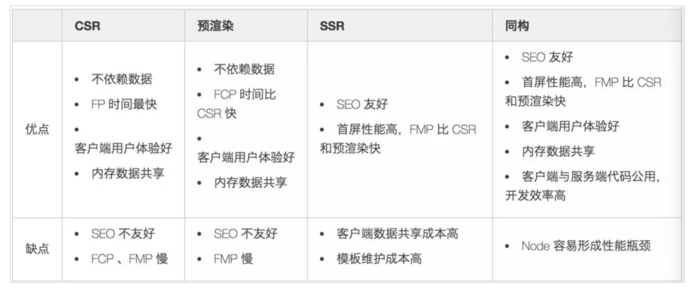

## 其他内容

### 页面加载中的性能优化

对比客户端渲染，预渲染，服务端渲染，同构的优缺点



## 引起 nodejs 内存泄露的情况

- 全局变量需要进程退出才能释放
- 闭包引用中间函数，中间函数不会释放，会使得原始的作用域不会释放，作用域不被释放它产生的内存占用也不会被释放，所以使用后设置为 null 等待垃圾回收
- 谨慎使用内存当做缓存，建议采用 Redis 或者 Memcached,外部缓存软件有成熟的缓存策略和内存管理，不影响 node 的主线程性能。减少内部常驻的对象数量能提高垃圾回收的效率，进程间共享缓存。

## 代码中异常的捕获

### 客户端异常捕获

- `try catch` 用来捕获同步代码异常
- 针对异步意料之外的错误的捕获: `try catch`无法捕获异步异常，捕获异步异常需要使用`window.onerror = function(msg, url, row, col, error) { ...;return true // 不向上抛出，阻止页面报红 }`
- 针对资源加载的错误捕获，比如 `html` 中 `image src` 路径不正确，可以使用`window.addEventListener('error', (msg, url, row, col, error) => {... ; return true}, true)`
- 针对 promise 的错误的捕获：(不用在每个 promise 上都写 catch)

```js
window.addEventListener('unhandledrejection', e => {
  e.preventDefault()
  console.warn(`UNHANDLED PROMISE REJECTION: ${event.reason}`)
  return true;
})
```

### 服务端异常捕获

```js
// 当未捕获的 JavaScript 异常一直冒泡回到事件循环时，会触发 'uncaughtException' 事件
// 正确使用 'uncaughtException' 事件的方式，是用它在进程结束前执行一些已分配资源（比如文件描述符，句柄等等）的同步清理操作。 触发 'uncaughtException' 事件后，用它来尝试恢复应用正常运行的操作是不安全的
process.on("uncaughtException", function() {
  process.exit(1);
});

// 如果在事件循环的一次轮询中，一个 Promise 被拒绝，并且此 Promise 没有绑定错误处理器， 'unhandledRejection 事件会被触发
process.on("unhandledRejection", function() {
  // ...
});

app.on("error", function() {
  // ...
});
```