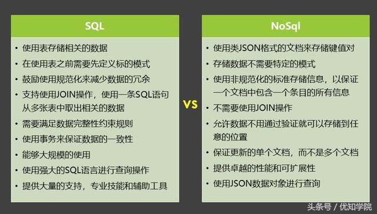

### mongodb
* MongoDB是一个基于分布式文件存储的开源数据库系统,由 C++ 语言编写。旨在为 WEB 应用提供可扩展的高性能数据存储解决方案
* MongoDB 是一个介于关系数据库和非关系数据库之间的产品，是非关系数据库当中功能最丰富，最像关系数据库的。
* MongoDB 将数据存储为一个文档，数据结构由键值(key=>value)对组成。MongoDB 文档类似于 JSON 对象。字段值可以包含其他文档，数组及文档数组。

提到Mongodb我们需要先了解下NoSql和分布式的概念

### NoSql
* NoSQL，指的是非关系型的数据库。 NoSQL(NoSQL = Not Only SQL )，意即"不仅仅是SQL"。
* 是对不同于传统的关系型数据库的数据库管理系统的统称,它具有非关系型、分布式、不提供ACID的数据库设计模式等特征。
* NoSQL用于超大规模数据的存储。这些类型的数据存储不需要固定的模式，无需多余操作就可以横向扩展。

sql和nosql的区别



SQL数据库适合那些需求确定和对数据完整性要去严格的项目。NoSQL数据库适用于那些对速度和可扩展性比较看重的那些不相关的，不确定和不断发展的需求。简单来说就是：

SQL是精确的。它最适合于具有精确标准的定义明确的项目。典型的使用场景是在线商店和银行系统。
NoSQL是多变的。它最适合于具有不确定需求的数据。典型的使用场景是社交网络，客户管理和网络分析系统。

* 关系型数据库遵循ACID规则

    1、A (Atomicity) 原子性  
    原子性很容易理解，也就是说事务里的所有操作要么全部做完，要么都不做，事务成功的条件是事务里的所有操作都成功，只要有一个操作失败，整个事务就失败，需要回滚。
    比如银行转账，从A账户转100元至B账户，分为两个步骤：1）从A账户取100元；2）存入100元至B账户。这两步要么一起完成，要么一起不完成，如果只完成第一步，第二步失败，钱会莫名其妙少了100元。

    2.C (Consistency) 一致性  
    一致性也比较容易理解，也就是说数据库要一直处于一致的状态，事务的运行不会改变数据库原本的一致性约束。
    例如现有完整性约束a+b=10，如果一个事务改变了a，那么必须得改变b，使得事务结束后依然满足a+b=10，否则事务失败。

    3.I (Isolation) 独立性  
    所谓的独立性是指并发的事务之间不会互相影响，如果一个事务要访问的数据正在被另外一个事务修改，只要另外一个事务未提交，它所访问的数据就不受未提交事务的影响。
    比如现在有个交易是从A账户转100元至B账户，在这个交易还未完成的情况下，如果此时B查询自己的账户，是看不到新增加的100元的。

    4.D (Durability) 持久性  
    持久性是指一旦事务提交后，它所做的修改将会永久的保存在数据库上，即使出现宕机也不会丢失。

* NoSql遵循BASE原则  
    * BASE：Basically Available, Soft-state, Eventually Consistent。
    * CAP理论的核心是：一个分布式系统不可能同时很好的满足一致性，可用性和分区容错性这三个需求，最多只能同时较好的满足两个。
    * BASE是NoSQL数据库通常对可用性及一致性的弱要求原则:  
        1.Basically Availble -- 基本可用  
        2.Soft-state -- 软状态/柔性事务。 "Soft state" 可以理解为"无连接"的, 而 "Hard state" 是"面向连接"的  
        3.Eventual Consistency -- 最终一致性， 也是是 ACID 的最终目的

### 分布式
分布式系统（distributed system）由多台计算机和通信的软件组件通过计算机网络连接（本地网络或广域网）组成。  
分布式系统是建立在网络之上的软件系统。正是因为软件的特性，所以分布式系统具有高度的内聚性和透明性。  
因此，网络和分布式系统之间的区别更多的在于高层软件（特别是操作系统），而不是硬件。  
分布式系统可以应用在不同的平台上如：Pc、工作站、局域网和广域网上等。  


### mongodb的概念和语法
```sh
# mac系统上，按照完毕后, 启动数据库服务，默认端口是27017，需要提前创建 /data/db文件夹存储数据
# 使用指定端口启动 mongod --dbpath 数据库路径 --port 指定的端口号
# 加 & 是守护进程，可以自由关闭shell
sudo mongod &

# 连接mongo服务
mongo
```

#### 基本概念：
* 数据库 MongoDB的单个实例可以容纳多个独立的数据库，比如一个学生管理系统就可以对应一个数据库实例
* 集合 数据库是由集合组成的,一个集合用来表示一个实体,如学生集合
* 文档 集合是由文档组成的，一个文档表示一条记录,比如一位同学张三就是一个文档


#### 数据库的操作

#### 集合的操作

#### 文档的操作


objectId的构成：
之前用传统的关系型数据库的时候，主键往往是设置成自增的，但在分布式的环境下，自增的主键就不可行了。因为会出现重复值。
为此，mongodb采用了一种ObjectId的类型来作为主键。objectid是12字节的BSON类型的字符串，按照字节顺序，依次代表
* 4字节： UNIX时间戳
* 3字节：表示运行mongodb的机器
* 2字节：表示生成此_id的进程
* 3字节：由一个随机数开始的计数器生成的值
