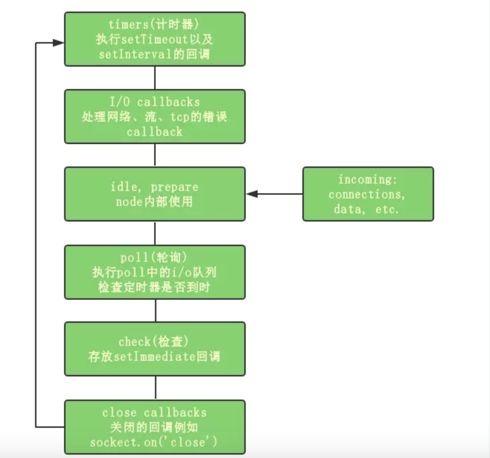

> 在聊Nodejs之前，我们先看看js中的一些概念，了解了这些概念后面理解Nodejs会更方便一些

js是一门**主线程**为单线程的语言，同时它要也是一门解释型语言。

* 编译型语言是代码在运行前编译器将人类可以理解的语言（编程语言）转换成机器可以理解的语言。
* 解释型语言也是人类可以理解的语言（编程语言），也需要转换成机器可以理解的语言才能执行，但是是在运行时转换的。所以执行前需要解释器安装在环境中；但是编译型语言编写的应用在编译后能直接运行。

所以虽然传统我们说js是从上到下，边编译边执行。但实际上更准确的说它是及时编译的，即js也是有预编译和执行两个过程的。
* 预编译阶段是前置阶段，这个时候由编译器将 JavaScript 代码编译成可执行的代码。 注意，这里的预编译和传统的编译并不一样，传统的编译非常复杂，涉及分词、解析、代码生成等过程 。这里的预编译是 JavaScript 中独特的概念，虽然 JavaScript 是解释型语言，编译一行，执行一行。但是在代码执行前，JavaScript 引擎确实会做一些“预先准备工作”。
    * 预编译阶段进行变量声明；
    * 预编译阶段变量声明进行提升，但是值为 undefined；
    * 预编译阶段所有非表达式的函数声明进行提升。

* 执行阶段主要任务是执行代码，执行上下文在这个阶段全部创建完成。

### 什么是线程和进程？
进程（process）和线程（thread）是操作系统的基本概念

* 进程：是执行中一段程序，即一旦程序被载入到内存中并准备执行，它就是一个进程。进程是表示资源分配的的基本概念，又是调度运行的基本单位，是系统中的并发执行的单位。
* 线程：单个进程中执行中每个任务就是一个线程。线程是进程中执行运算的最小单位。

对于操作系统来说，一个任务就是一个进程（Process），比如打开一个浏览器就是启动一个浏览器进程，打开一个记事本就启动了一个记事本进程，打开两个记事本就启动了两个记事本进程，打开一个Word就启动了一个Word进程。

有些进程还不止同时干一件事，比如Word，它可以同时进行打字、拼写检查、打印等事情。在一个进程内部，要同时干多件事，就需要同时运行多个“子任务”，我们把进程内的这些“子任务”称为线程（Thread）。

我们常常说的多线程的任务处理和多进程的原理是一样的，它们都是调用CPU去“同时”做很多的事情，所谓的“同时”是相对的，如果你的CUP是单核的，需要“同时”处理4件事情，它会轮流让各个任务交替执行，任务1执行0.01秒，切换到任务2，任务2执行0.01秒，再切换到任务3，执行0.01秒……这样反复执行下去。表面上看，每个任务都是交替执行的，但是，由于CPU的执行速度实在是太快了，我们感觉就像所有任务都在同时执行一样。

如果是4核CPU执行4件事情就是“真正”的执行了多任务，但是，由于任务数量远远多于CPU的核心数量，所以，操作系统也会自动把很多任务轮流调度到每个核心上执行。


**为什么说主线程是单线程？**
* 这是由 Javascript 这门脚本语言的用途决定的。
* Web Worker并没有改变 JavaScript 单线程的本质。
* js本身不可能是异步的，但js的宿主环境（比如浏览器，Node）是多线程的，宿主环境通过某种方式（事件驱动，下文会讲）使得js具备了异步的属性。

我们可以先看一个浏览器的模型图


* 用户界面-包括地址栏、前进/后退按钮、书签菜单等
* 浏览器引擎-在用户界面和呈现引擎之间传送指令
* 呈现引擎-又称渲染引擎，也被称为浏览器内核，在线程方面又称为UI线程
* 网络-用于网络调用，比如 HTTP 请求
* 用户界面后端-用于绘制基本的窗口小部件,UI线程和JS共用一个线程
* JavaScript解释器-用于解析和执行 JavaScript 代码
* 数据存储-这是持久层。浏览器需要在硬盘上保存各种数据，例如 Cookie

除JS线程和UI线程之外的其它线程
* 浏览器事件触发线程
* 定时触发器线程
* 异步HTTP请求线程


1. 所有同步任务都在主线程上执行，形成一个执行栈
2. 主线程之外，还存在一个任务队列。只要异步任务有了运行结果，就在任务队列之中放置一个事件。
3. 一旦执行栈中的所有同步任务执行完毕，系统就会读取任务队列，看看里面有哪些事件。那些对应的异步任务，于是结束等待状态，进入执行栈，开始执行。
4. 主线程不断重复上面的第三步。


### 什么是宏任务和微任务？

异步任务可以分为两类：分别就是宏任务和微任务
* 常见的宏任务macrotask有：setTimeout、setInterval、 setImmediate(ie浏览器才支持,node中自己也实现了)、MessageChannel
* 常见的微任务microtask有：promise.then()、process.nextTick(node的)

**是什么是浏览器事件环?**
浏览器中，事件环的运行机制是，先会执行栈中的内容，栈中的内容执行后执行微任务，微任务清空后再执行宏任务，先取出一个宏任务，再去执行微任务，然后在取宏任务清微任务这样不停的循环。

> 从图中可以看出，同步任务会进入执行栈，而异步任务会进入任务队列（callback queue）等待执行。一旦执行栈中的内容执行完毕，就会读取任务队列中等待的任务放入执行栈开始执行。

```js
setTimeout(() => {
    console.log('setTimeout1');
    Promise.resolve().then(data => {
        console.log('then3');
    });
},1000);
Promise.resolve().then(data => {
    console.log('then1');
});
Promise.resolve().then(data => {
    console.log('then2');
    setTimeout(() => {
        console.log('setTimeout2');
    },1000);
});
console.log(2);

// 输出结果：2 then1 then2 setTimeout1  then3  setTimeout2
```

> 1. 先执行栈中的内容，也就是同步代码，所以2被输出出来；
> 2. 然后清空微任务，所以依次输出的是 then1 then2；
> 3. 因代码是从上到下执行的，所以1s后 setTimeout1 被执行输出；
> 4. 接着再次清空微任务，then3被输出；
> 5. 最后执行输出setTimeout2

再来看一个例子：
```js
async function async1() {
    console.log('async start');
    let value = await async2();
    console.log(value);
}

async function async2() {
    console.log('async2');
    new Promise((resolve, reject) => {
        console.log('async2-promise');
        resolve('p-test');
    }).then(value => {
        console.log(value);
    });
    let value = await 123;
    return value;
}

console.log('script start');

async1();

new Promise((resolve, reject) => {
    console.log('promise 1');
    resolve();
}).then(() => {
    console.log('promise1 then')
});

console.log('script end');

// 执行顺序如下：
// script start - async start - async2 - async2-promise - promise 1 -  script end - p-test - promise1 then - 123
```


****

下面我们来正式的聊一聊nodejs

### 什么是nodejs
我们都知道完整的JS由三部分组成：
* DOM (Document Object Model)
* BOM (Browser Object Model)
* ECMAScript (js基本语法)

nodejs只有上面的ECMAScript部分

* Node.js 是一个基于 Chrome V8 引擎的 JavaScript 运行环境,让JavaScript的执行效率与低端的C语言的相近的执行效率。它运行在服务端,所以仅仅包含js的ECMAScript部分。
* Node.js 使用了一个事件驱动、非阻塞式 I/O 的模型，使其轻量又高效。
* Node.js 的包管理器 npm，是全球最大的开源库生态系统。

进一步说明解释：
我们常常说到性能，主要有 cup密集型（大量的计算，加密，解密...） 和 i/o密集型（文件读取，并发请求）
因为js是单线程，只支持单核CPU，不能充分利用CPU。所以nodejs不适合做大量的运算, 但是适合高并发和I/O密集型应用。
可靠性不够高，一旦代码某个环节崩溃，整个系统都崩溃
异步/同步：被调用方，可以决定此方法是同步还是异步
阻塞/非阻塞：调用方的状态就是阻塞、非阻塞。 同步对应阻塞，异步对应非阻塞。 **同步阻塞，异步非阻塞**

### REPL
> 在Node.js中为了使开发者方便测试JavaScript代码，提供了一个名为REPL(Read Eval Print Loop)的可交互式运行环境。开发者可以在该运行环境中输入任何JavaScript表达式，当用户按下回车键后，REPL运行环境将显示该表达式的运行结果。

在命令行容器中输入node命令并按下回车键，即可进入REPL运行环境。

REPL的操作：
* 变量的操作，声明普通对象和变量
* eval
* 函数的书写
* 下划线访问最近使用的表达式
* 多行书写
* REPL运行环境中的上下文对象

REPL运行环境的基础命令： 
* .break退出当前命令
* .clear 清除REPL运行环境上下文对象中保存的所有变量与函数
* .exit 退出REPL运行环境
* .save 把输入的所有表达式保存到一个文件中
* .load 把所有的表达式加载到REPL运行环境中
* .help 查看帮助命令


### Nodejs的事件环
Node的事件环机制与浏览器的是不太一样。 在Node运行环境中：
* 我们写的js代码会交由V8引擎进行处理
* 代码中可能会调用NodeApi，node会交由libuv处理
* libuv通过阻塞I/O和多线程实现异步I/O
* 然后通过事件驱动的方式，将结果放到事件队列中，最终交给我们的应用。
其实本质是在libuv(一个高性能的，事件驱动的I/O库)内部有这样一个事件环机制。在Node启动时会初始化事件环。



图中显示的每个阶段都对应一个事件队列，当event loop执行到某个阶段时会将当前阶段对应的队列依次执行。当队列执行完毕或者执行数量超过上限时，才会转入下一个阶段。node中的微任务在切换队列时执行。

* 主执行栈
* 微任务 （promise.then < process.nextTick）只要队列发生切换就会执行微任务
* timers计时器：执行setTimeout、setInterval的回调函数；
* I/O callbacks：执行I/O callback被延迟到下一阶段执行
* idle, prepare：队列的移动，仅内部使用
* poll 轮询：检索新的I/O事件;执行I/O相关的回调
* check：执行setImmediate回调
* close callbacks：执行close事件的callback，例如socket.on("close",func)
* poll 阶段的下一个阶段是check，如果check队列中有东西，会先执行check

看几个例子：
```js
setTimeout(function () {
    console.log('setTimeout');
});
setImmediate(function () {
    console.log('setImmediate');
});
```
> 这道题中如果你在node环境中多运行几次，就会发现输出顺序是不固定的。
> 这里我们要根据前面的那个事件循环不同阶段的图解来说明一下：
> 首先进入的是timers阶段，如果我们的机器性能一般，那么进入timers阶段，一毫秒已经过去了（setTimeout(fn, 0)等价于setTimeout(fn, 1)），那么setTimeout的回调会首先执行。  
> 如果没有到一毫秒，那么在timers阶段的时候，下限时间没到，setTimeout回调不执行，事件循环来到了poll阶段，这个时候队列为空，此时有代码被setImmediate()，于是先执行了setImmediate()的回调函数，之后在下一个事件循环再执行setTimemout的回调函数。
> 而我们在执行代码的时候，进入timers的时间延迟其实是随机的，并不是确定的，所以会出现两个函数执行顺序随机的情况。

```js
setImmediate(() => {
  console.log('setImmediate1');
  setTimeout(() => {
      console.log('setTimeout1')
  }, 0);
});
Promise.resolve().then(res=>{
  console.log('then');
})
setTimeout(() => {
  process.nextTick(() => {
      console.log('nextTick');
  });
  console.log('setTimeout2');
  setImmediate(() => {
      console.log('setImmediate2');
  });
}, 0);
```

> 这道题的输出顺序是：then、setTimeout2、nextTick、setImmediate1、setImmediate2、setTimeout1，为什么是这样的顺序呢？微任务nextTick的输出是因为timers队列切换到check队列，setImmediate1和setImmediate2连续输出是因只有当前队列执行完毕后才能进去下一对列。


### Node Core
全局作用域 （全局作用域(global)可以定义一些不需要通过任何模块的加载即可使用的变量、函数或类）- 类似于浏览器中的windows(在浏览器中window代理了global)
* 定义全局变量时变量会成为global的属性
* 永远不要不使用var关键字定义变量，以免污染全局作用域

```js
console.log(global);

// 打印global可以看到它的内容
// 主要内容：
// process 进程 - 当前运行环境
// Buffer 读取的内容，都是二进制文件, 专门存放二进制数据的缓存区。 通过使用显式的字符编码，就可以在 Buffer 实例与普通的 JavaScript 字符串之间进行相互转换。
// clearInterval setTimeout 定时器 宏任务
// clearImmediate setImmediate 宏任务
```
**console**
向Node内置的console模块，==提供命令行环境中的标准输入==，标准输出功能。点击查看console相关信息

**process**
> 在node.js里，process 对象代表node.js应用程序，可以获取应用程序的用户，运行环境等各种信息

```js
process.cwd(); // 当前工作目录. 在哪里执行，就显示出位置
process.env; // 显示当前进程的整个运行环境
process.argv; //  属性返回一个数组，其中包含当启动 Node.js 进程时传入的命令行参数。 第一个元素是 process.execPath。 如果需要访问 argv[0] 的原始值，参阅 process.argv0。 第二个元素将是正在执行的 JavaScript 文件的路径。
process.nextTick(callback[, ...args]); // 方法将 callback 添加到下一个时间点的队列。 一旦当轮的事件循环全部完成，则调用下一个时间点的队列中的所有回调。 它将callBack方法推入的是微任务队列，执行优先级比setTimeout更高
process.env; //属性返回包含用户环境的对象
```

小例子：
```js
process.env.NODE_ENV = 'production';
if (process.env.NODE_ENV === 'production') {
    console.log('生产环境'); 
} else {
    console.log('开发环境');
}
```

```js
//  node 1.js --port 3000
let args = process.argv.slice(2); // ['--port', 3000]
let obj = {};
args.reduce((beforeArg, afterArg) => {
    if (beforeArg.includes('--')) {
        obj[beforeArg.slice(2)] = afterArg;
    }
    return afterArg;
});
console.log(obj);
```

**全局函数** 
* setTimeout() - 用于在指定毫秒之后运行回调函数，指定毫秒数须在1-2,147,483,647毫秒（约24.8天）之间，该方法返回一个整数，代表这个新建定时器的编号。
* clearTimeout() - 用于终止一个setTimeout方法新建的定时器
* setInterval() - 每隔一定毫秒调用回调，指定毫秒数须在1-2,147,483,647毫秒（约24.8天）之间，超出则自动改为1毫秒，该方法返回一个整数，代表这个新建定时器的编号。
* clearInterval() - 用于终止一个setInterval方法新建的定时器。
* require() - 用于加载模块。
* Buffer() - 用于操作二进制数据。Buffer 类的实例类似于整数数组


**全局变量**
* __dirname：指向当前运行脚本所在的目录
* __filename：指向当前运行脚本的文件名，当前模块的文件名称---解析后的绝对路径。


### Node 模块
* JS没有模块系统，不支持封闭的作用域和依赖管理
* 没有标准库，没有文件系统和IO流API
* 也没有包管理系统

模块化解决的问题：命名冲突，代码方便维护，人员协作，依赖关系
Node中模块分类：
* 原生基本模块
http path fs util events 编译成二进制,加载速度最快，原生模块直接通过名称来加载

* 文件模块
在硬盘的某个位置，加载速度非常慢，文件模块通过名称或路径来加载 文件模块的后缀有三种
    * 后缀名为.js的JavaScript脚本文件,需要先读入内存再运行
    * 后缀名为.json的JSON文件,fs 读入内存 转化成JSON对象
    * 后缀名为.node的经过编译后的二进制C/C++扩展模块文件,可以直接使用

* 第三方模块
    * 如果require函数只指定名称则视为从node_modules下面加载文件，这样的话你可以移动模块而不需要修改引用的模块路径
    * 第三方模块的查询路径包括module.paths和全局目录


### Node 如何实现模块化？
早期的模块化解决方案：seajs, cmd, requirejs, amd
到现在的CommonJS规范 - 通过文件读取到方式（utf8）实现了模块化
1. 文件即模块
2. 定义导出方式，module.exports, exports.
3. 定义了导入方式：require

```js
// commonjs 使用
// hello.js
var s = 'hello';
function test(name) {
    console.log( s + name);
}
module.exports = test;
```
函数test()是我们在hello模块中定义的，你可能注意到最后一行是一个奇怪的赋值语句，它的意思是，把函数test作为模块的输出暴露出去，这样其他模块就可以使用test函数了。

其他模块怎么使用hello模块的这个greet函数呢？
```js
// main.js
var fn = require('./hello');
fn('world'); // hello world

// 引入hello模块用Node提供的require函数
```
变量fn就是在hello.js中我们用module.exports = test;输出的test函数。所以，main.js就成功地引用了hello.js模块中定义的test()函数，接下来就可以直接使用它了。

如果只写模块名：
```js
var fn = require('hello');
```
则Node会依次在内置模块、全局模块和当前模块下查找hello.js，你很可能会得到一个错误。

导出模块除了可以使用 **module.exports = xxx** 之外，还可以直接使用 **exports.xx = xxx**
```js
function hello() {
    console.log('Hello, world!');
}

function greet(name) {
    console.log('Hello, ' + name + '!');
}

// 导出方法一
module.exports = {
    hello: hello,
    greet: greet
};

// 导出方法二
exports.hello = hello;
exports.greent = greet;
```
但是 **exports** 只能导出对象，且不可以直接给它赋值
```js
// 这样不会报错，但却是无效的
exports = {
    hello : hello,
    grent : grent 
}
```
原因是和Commonjs的加载机制有关系，后面会分析到。
现在先得出结论：
* 如果要输出一个键值对象{}，可以利用exports这个已存在的空对象{}，并继续在上面添加新的键值；
* 如果要输出一个函数或数组，必须直接对module.exports对象赋值。
* 所以我们可以得出结论：直接对module.exports赋值，可以应对任何情况：


### Commonjs 加载机制
Commonjs通过文件读取拿到相关的文件中的内容，这些内容拿到手（Commonjs内部）可能是一堆字符串，它是如何让字符串执行为代码的呢？
如果让我们去考虑这个问题，常见的解决方法有下面几种：
1. eval (stringCode) - 使用eval函数去执行字符串, 这样做的问题是？
```js
let a = '123';
let code = 'console.log(a)';
eval(code);
// 从上面代码中我们可以看到，eval中的代码和外部代码没有完全隔离开，存在明显的依赖关系。如果eval中的变量名和外面一样也会将外面的替换掉。 这样就没有解决模块化的问题
```

2. 使用function来实现
```js
var a = '123';
var code = 'var a = "234"; console.log(a)';
var fn = new Function('a', code);
fn(a);

// 和eval类似也会外部和内部环境也会相互影响
```
上面两种方法都不合适

Node中的Commonjs, 实现“模块”功能的奥妙就在于JavaScript是一种函数式编程语言，它支持闭包。
我们使用runInThisContext将字符串执行为代码，执行之前
如果我们把一段JavaScript代码用一个函数包装起来，这段代码的所有“全局”变量就变成了函数内部的局部变量。

Commonjs require方法的实现
* 内置实现了一个require的方法
* 通过Module._load方法加载模块
* Module._resolveFilename 根据相对路径转化为绝对路径，并增加后缀
* 判断Module._cache缓存中是否有当前内容，
* new Module 创建的模块，id 存的是需要加载文件的全局路径
* tryModuleLoad（Module） 尝试加载这个模块
    * 取出文件的后缀
    * 加载模块 （读取文件）
    * Module.wrap 包裹读取的内容 
    （"(function (exports, require, module, __filename, __dirname) { "  "});"）
    * 使用runInthisContext运行字符串
    * 让字符串执行 this改变成 exports


我们可以自己手写一个简单的require 验证下Commonjs的读取文件的一个整体的流程
```js
let path = require('path');
let fs = require('fs');
let vm = require('vm');

function Module(id) {
    this.id = id;
    this.exports = {};
}

Module.wrapper = [
    '(function(exports, module, require, __dirname, __filename) {',    
    '})'
]

Module.cache = {}

Module.extNameList = {
    '.js': function (module) {
       let content = fs.readFileSync(module.id, 'utf8');
       let fnStr = Module.wrapper[0] + content + Module.wrapper[1]; 
       let fn = vm.runInThisContext(fnStr);
       fn.call(module.exports, module.exports, module, req);
    },
    '.json': function(module) {
        let json = fs.readFileSync(module.id, 'utf8');
        module.exports = json;
    }
}

function tryModuleLoad(module) {
    let extName = path.extname(module.id);
    Module.extNameList[extName](module);
}

function req(filePath) {
    let absFilePath = path.resolve(__dirname, filePath);

    let index = 0;
    let extnameList = Object.keys(Module.extNameList);
    let extname = path.extname(absFilePath);

    if (!extname) {
        loopFileExtendName();
    }   

    function loopFileExtendName() {
        if (index >= extnameList.length) {
            throw new Error('文件不存在');
        }
        let tempFilePath = absFilePath + extnameList[index++];
        try {
            fs.accessSync(tempFilePath);
            absFilePath = tempFilePath;
        } catch(e) {
            loopFileExtendName();
        }
    }


    if (Module.cache[absFilePath]) {
        return Module.cache[absFilePath].exports;    
    } else {
        let module = new Module(absFilePath);
        Module.cache[absFilePath] = module;
        tryModuleLoad(module);
        return module.exports;
    }
    
}

let obj = req('./a.js');
console.log(obj);
```
通过上面我们自己写的简单的模拟require方法，我们知道了exports导出的内容是如何一步步转变问require接收到的内容的。
同时通过 ==_extendsions== 的内部逻辑，可以看到 exports, module.exports 都指向同一个对象，这也就是为什么exports也能导出对象的原因了。但exports只能添加对象，如 ==exports.test = test==, 如果直接复制方法或者其他对象，指针发生变化，就无效了。


### npm的相关使用 & 全局模块 
npm是nodejs自带的包管理工具，通过它可以下载第三方模块。 
我们来了解下npm的使用：
* 查看npm全局配置信息
```js
npm config ls
```

* 查看npm根目录路径
```js
npm root -g

// 修改全局安装目录
npm config set prefix “D:\node.js\node_global”
```

* 用npm安装第三方库
```
// 安装全局包 (安装到本地文件夹中) - 具体路径：npm root -g
// 全局安装包安装后在在任何位置的命令行中去运行
npm install {库名}@版本号 -g

// 安装局部包 （安装到当前项目所在的node_module文件夹中）
// 在当前项目的代码中使用
npm install {库名}@版本号
```

当我们在一个文件中引入 ==require({第三方包})== 的时候，它会根据module.exports进行查找(查找node_modules文件夹内部的文件)，找到后返回，找不到就继续向上级（Module.paths 数组列表） 查找。 当找到文件夹名称相同后，查找文件夹内的package.json文件，找到对应的 ==main==参数的入口，如果没有package.json 或者package.json中没有key为main的值，就默认查找index.js


* 卸载第三方包
```
npm uninstall {库名} -g
npm uninstall {库名}
```
* 实现全局命令
    1) 需要在package.json中添加bin的配置
    2) 前面是命令，后面是执行的文件
        ```
        "bin": {
            "wd": "./wd-test.js"
        }
        ```
    3) #！/usr/bin/env node (使用node来运行文件)
        ```
        #! /usr/bin/env node
        console.log('wd-test');
        ```
    4) 拷贝到 ==npm root -g==所在目录下，或者本地调试的时候到需要使用的第三方库文件夹下 运行 ==npm link== 链接到全局安装目录去。

* 发布一个自己写的包到npm官网
    1) 将npm的源切换为官方的源（不要用taobao源或者cpm, 否则无法提交成功）- 可以使用nrm (npm源管理)来切换
        ```
        npm install nrm -g
        nrm use npm
        ```
    2) 登录账号
        ```
        npm addUser
        ```
    3) 发布代码，进入需要发布代码的文件夹，运行： 
        ```
        npm publish 
        ```
    4) 取消发布
        ```
        npm unpublish --force
        ```

* yarn 
    yarn是facebook主推的一个包管理工具，下载速度比npm更快，版本控制更好。
    ```
    npm install yarn -g
    yarn global add ${第三方库}
    yarn add ${第三方库}
    yarn remove ${第三方库}
    ```


参考：
* http://www.zhufengpeixun.cn/architecture/html/3.Node.html
* https://juejin.im/post/5b5f365e6fb9a04fa8673f97
* https://www.cnblogs.com/woodyblog/p/6061671.html


