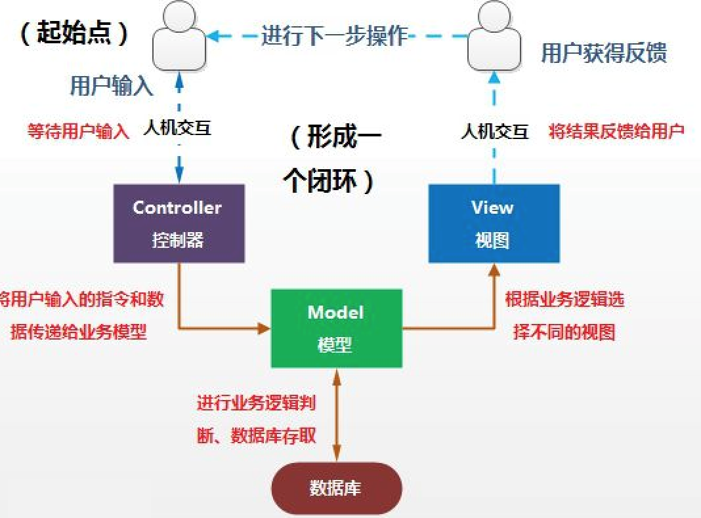
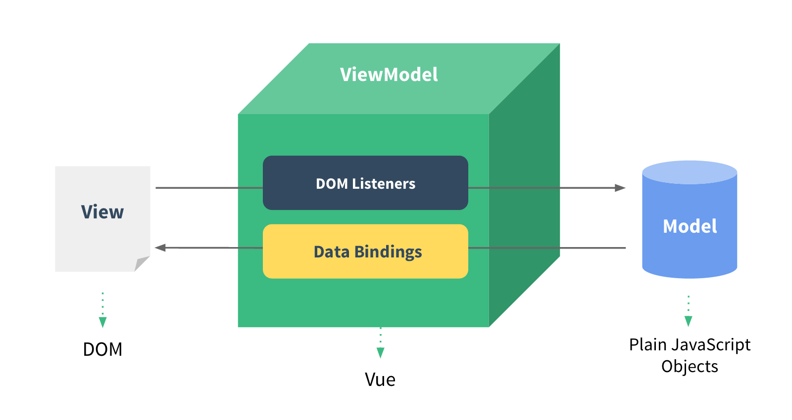

后面相当长的一段时间，我会学习vuejs的相关内容。
说来惭愧，vuejs应该是绝大部分前端都会的框架，但我的学习路径确是从angular (不是angularjs)开始的。
虽然angular在我看来，除了比较“重”以外，没有什么明显的缺点。但vuejs的大热还是倒推着我去学习它。抛开语法不说，它们的核心思想和理念有很多异曲同工的地方。有一定基础的上手起来应该会稍微轻松点吧。

Vue (读音 /vjuː/，类似于 view) 是一套用于构建用户界面的渐进式框架
> 比较自豪的一点是它的创作者是一位中国人，我想这个因素也是为它这么火加了不少分吧

这里先确认两个概念，
* 什么是库？什么是框架？
    * 库（jquery）将代码集合成一个产品，我们来调用库中的方法来实现自己的功能（我们是主导方）
    * 框架（react, angular, vue）为解决一类问题而开发出来的产品，我们遵循框架的规则和语法，在指定的位置填写对应的代码。框架来帮我们调用（框架是主导方）
* mv-c 和 mv-vm (这里的mvc是前端的mvc和 java后端语言的mvc有细微的区别)
    * m - model (模型层), v - view(视图层)，c - controller(控制层)， vm - viewmodel(视图模型层)
    * mvc如下：
        
    * mvvm 如下
        
    * 区别：在传统的mvc中除了model和view以外的逻辑都放在了controller中，导致controller逻辑复杂难以维护,在mvvm中view和model没有直接的关系，全部通过viewModel进行交互

开始安装&运行 vue（先不使用vue-cli）
```html
- yarn init -y
- yarn add vue

<!-- 1-start.html -->
<!DOCTYPE html>
<html lang="en">
<head>
    <meta charset="UTF-8">
    <meta name="viewport" content="width=device-width, initial-scale=1.0">
    <meta http-equiv="X-UA-Compatible" content="ie=edge">
    <!-- 导入vue.js -->
    <script src="node_modules/vue/dist/vue.js"></script>
    <title>Document</title>
</head>
<body>
    <div id="app">
        hello world
        {{ arr }}
        {{ obj }}
    </div>

    <script>
        // new 一个vue对象出来，传入的参数：el, data
        let vm = new Vue({
            el: '#app',
            data: {
                arr: [1,2,3],
                obj: {
                    name: 'z3'
                }
            }
        });
        vm.arr1 = [1,2,3,4,5];
        vm.obj.name = 'l4';
        vm.obj.age = '14';
    </script>
</body>
</html>
```


